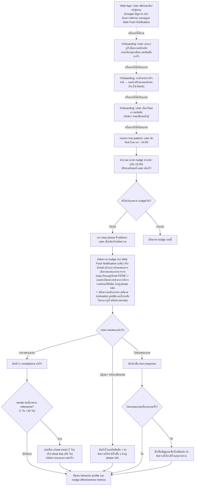

# User Journey — Proactive Nudge ก่อนเวลาเสี่ยง

Journey นี้อธิบาย flow: **"AI ส่งข้อความเตือนก่อนถึงเวลาเสี่ยง (เช่น ก่อนบ่าย 2 โมงที่ user มักกินชาไทย) แล้วเสนอทางเลือกทดแทน"** ซึ่งเป็นหัวใจของฟีเจอร์ Proactive Nudge (F5, F6 ใน [[../../01-requirements/02-plan/20260827-01-feature-list|Feature List]]) อ้างอิงจาก [[../../01-requirements/01-spec/20260827-01-jaifit-ai-coach-metabolic-transition|Requirement Spec]]

> **หมายเหตุ (2026-08-28 — Pivot ช่องทาง):** Journey นี้แสดง user บน **Web App** (ไม่ใช่ LINE OA เหมือนเวอร์ชันก่อนหน้า) — logic การตัดสินใจทุกจุดเหมือนเดิมทุกประการ เปลี่ยนแค่ node ที่เกี่ยวกับช่องทางส่งข้อความ (step E) และเพิ่ม step S (สมัครสมาชิก/เข้าสู่ระบบ) ก่อนเริ่ม onboarding เดิม เพราะ Web App ต้องระบุตัวตน user เอง ไม่ได้อิง LINE user ID อัตโนมัติ
>
> **หมายเหตุ (2026-08-29 — ปิด Open Questions รอบ 4):** เพิ่ม step CC (Chronic Condition Screening) หลัง step AM และก่อน step A0 ตาม FR12 ใหม่, step B/C ใช้ default เวลาส่งล่วงหน้า 15-30 นาที + เพดาน nudge/วันที่ปรับอัตโนมัติตาม phase แล้ว (เดิม open question 10.1/10.3 — ปิดแล้ว), step K ใช้เกณฑ์ detect แบบผสม (keyword + engagement pattern ตาม 10.2 — ปิดแล้ว), step M/N มี grace day 1 วันก่อนตัดจริง (ตาม 10.9 — ปิดแล้ว) — รายละเอียดเต็มดู [[../../05-log/20260829-log|log 2026-08-29]]

## Diagram

## Mapping กลับไปยัง Requirement

| Step | สิ่งที่เกิดขึ้น | อ้างอิง Requirement |
|---|---|---|
| S | User สมัครสมาชิก/เข้าสู่ระบบด้วยอีเมล + รหัสผ่าน และอนุญาต Web Push Notification บน Web App (ครั้งแรกที่ใช้งานเท่านั้น) | FR11 (F35, F36, F37, F38) |
| AM | User เล่าแรงจูงใจ/สาเหตุที่อยากลดน้ำหนักตอน onboarding ระบบจัดกลุ่มเป็นระดับความเข้มแข็งทางใจ | FR10 (F30, F31) |
| CC | User ถูกถามว่ามีโรคประจำตัวหรือไม่ตอน onboarding — หากมี ระบบแนะนำให้ปรึกษาแพทย์ก่อนเริ่มโปรแกรม (ไม่ block การใช้งาน), หากไม่มีเริ่มโปรแกรมได้ตามปกติ | FR12 (F40, F41, F42) |
| A0 | User เลือกโหมดความเข้มข้น (หักดิบ / ค่อยเป็นค่อยไป) ตอน onboarding ครั้งแรกที่เริ่มโปรแกรม | FR6 (F18) |
| A | ระบบตรวจพบ pattern พฤติกรรมเสี่ยงของ user (เวลา/เมนู) จาก behavior profile ที่สะสมไว้จากบทสนทนา | FR1 (F2) |
| B | คำนวณเวลาที่จะส่ง nudge ล่วงหน้าก่อนถึงช่วงเวลาเสี่ยง โดยปรับตามโหมดความเข้มข้นที่เลือกไว้ (A0) | FR2 (F5), FR6 (F19, F20) |
| C | ตรวจสอบว่ายังไม่เกินเพดานจำนวน nudge ต่อวัน (ปรับอัตโนมัติตาม phase — phase หนักส่งถี่กว่า) ก่อนตัดสินใจส่ง | FR2 (F7) — เดิม open question 10.3 ปิดแล้ว ค่า threshold ตัวเลขจริงต่อ phase ยังกำหนดตอน implement |
| D | เลือกโทนข้อความให้เหมาะกับ phase ปัจจุบันของ user (เช่น phase หนัก = ให้กำลังใจมากกว่า) | FR3 (F10) |
| E | ส่งข้อความ nudge ผ่าน Web Push Notification (หลัก) หรือ Email (สำรอง) พร้อมทางเลือกทดแทนเฉพาะเจาะจง (หมุนเวียนไม่ให้ซ้ำ) แนบคำเตือนล่วงหน้าอาการที่อาจเจอพร้อมวิธีรับมือ และปรับความหนักเบา/ความถี่ตาม motivation profile (AM) พร้อมโยงกลับไปหาแรงจูงใจเดิมของ user | FR2 (F5, F6), FR7 (F22, F23), FR8 (F24, F25), FR10 (F32, F33) |
| F | User ตอบสนองต่อ nudge (ทำตาม / ปฏิเสธ / เงียบ) | FR2 |
| G | บันทึกผลว่า user ทำตามคำแนะนำ เพื่อใช้สรุปใน dashboard | FR5 (F16) |
| M, N | ตรวจสอบว่า streak ต่อเนื่องของ user ครบ milestone (7 วัน / 30 วัน) หรือยัง ถ้าครบให้ปลดล็อก cheat meal/cheat day และส่งข้อความฉลอง | FR9 (F26, F27, F28) |
| H | บันทึกการปฏิเสธแบบไม่ตัดสิน และถ้าอยู่ใน phase หนัก ให้ส่งข้อความให้กำลังใจเสริม (ปรับความถี่/โยงแรงจูงใจตาม AM) | FR3 (F10), FR4 (F12), FR10 (F32, F33) |
| I | บันทึกว่า user ไม่ตอบสนอง nudge รอบนี้ | FR1 (F4) |
| K, L | ถ้า user ไม่ตอบสนอง nudge ต่อเนื่องหลายครั้ง (ร่วมกับ keyword/sentiment detection จากข้อความ) ให้ถือเป็นสัญญาณเสี่ยงใกล้ล้มเลิก แล้ว trigger ข้อความให้กำลังใจแบบเร่งด่วน | FR4 (F13) — ยืนยันแล้วว่าใช้กลไกผสมทั้ง keyword/sentiment detection และ engagement pattern ร่วมกัน (เดิม open question 10.2 ปิดแล้ว) จำนวนครั้ง "ติดต่อกัน" ที่แน่นอนยังกำหนดตอน implement |
| J | อัปเดต behavior profile และ nudge effectiveness metrics เพื่อปรับปรุง pattern และเนื้อหา dashboard ครั้งถัดไป | FR1 (F4), FR5 (F16, F17) |

## Edge Case ที่ครอบคลุมใน Journey นี้

- **User ไม่ตอบสนอง nudge เลย** — ระบบไม่ปล่อยผ่านเฉย ๆ แต่สะสมเป็นสัญญาณ และถ้าเกิดต่อเนื่องหลายครั้งจะ trigger ข้อความให้กำลังใจแบบเร่งด่วนตาม FR4 (step K→L)
- **User ปฏิเสธทางเลือกทดแทนตรง ๆ** — ระบบต้องไม่ตัดสิน (non-judgmental) และยังคงบันทึกไว้เพื่อปรับ pattern ในอนาคต (step H) สอดคล้องกับโทนที่ FR4 กำหนดไว้

## สมมติฐาน/คำถามที่ต้องยืนยัน

- **จำนวนครั้งที่ถือว่า "ไม่ตอบสนองต่อเนื่องหลายครั้ง" (step K)** ยังไม่มีตัวเลขที่ยืนยันในเอกสารต้นทาง แม้กลไก detect แบบผสม (keyword + engagement pattern) จะยืนยันแล้ว (เดิม open question 10.2) — ต้องกำหนดค่าจริง (เช่น 3 ครั้งติดกัน) ก่อนนำไป implement
- **เพดานจำนวน nudge ต่อวัน (step C)** ยืนยันแล้วว่าปรับอัตโนมัติตาม phase (เดิม open question 10.3) และ **ระยะเวลาส่งล่วงหน้า (step B)** ยืนยันแล้วว่า default 15-30 นาที + ปรับเองได้ภายหลัง (เดิม open question 10.1) — ค่า threshold ตัวเลขจริงของแต่ละ phase ยังต้องกำหนดตอน implement
- Journey นี้สมมติว่า user มี behavior profile สะสมมาแล้วอย่างน้อย 1 pattern (เช่น "กินชาไทยบ่าย 2") — ยังไม่ครอบคลุม flow ตอน user ใหม่ที่ยังไม่มีข้อมูลพอให้ระบบ detect pattern ได้ (เป็น journey แยกที่ควรทำเพิ่มภายหลัง)
- **Step A0 (เลือกโหมดความเข้มข้น)** วาดเป็น dashed line เพราะเกิดขึ้นครั้งเดียวตอน onboarding ไม่ใช่ทุกรอบของ nudge loop — การเปลี่ยนโหมดภายหลัง (F21) ยืนยันแล้วว่าเปลี่ยนได้ไม่จำกัดจำนวนครั้งพร้อมต้องอธิบายผลลัพธ์ก่อนเปลี่ยนทุกครั้ง (F39, เดิม open question 10.6) แต่ยังไม่ได้ทำเป็น journey แยกในเอกสารนี้
- **Step AM (เก็บ motivation profile)** วาดเป็น dashed line ก่อน CC/A0 ด้วยเหตุผลเดียวกัน คือเกิดขึ้นครั้งเดียวตอน onboarding — วางไว้ก่อนเพราะสมมติว่าระบบควรรู้แรงจูงใจของ user ก่อนเริ่มอธิบาย/ให้เลือกโหมดความเข้มข้น แต่ลำดับที่แท้จริงระหว่าง AM, CC, A0 (ถามอะไรก่อน) ยังไม่ใช่การตัดสินใจที่ยืนยันแล้วจากเอกสารต้นทาง — เป็นสมมติฐานเชิง UX ที่ควรทดสอบกับ user จริง
- **Step CC (Chronic Condition Screening)** เป็น step ใหม่จากการปิด open question 10.4 (2026-08-29) — วางไว้หลัง AM และก่อน A0 ตามสมมติฐานเชิง UX เดียวกับข้างต้น ยังไม่มี mockup/รายละเอียดว่าถามแบบ conversational หรือฟอร์มปิด และยังไม่ยืนยันว่ากรณีอาการแย่ลงมากในวันที่ 1-7 (Adaptive Symptom Easing, FR13) ควร trigger จาก step ไหนของ journey นี้โดยตรง — ควรทำเป็น journey แยกภายหลัง
- **Step S (สมัครสมาชิก/เข้าสู่ระบบ)** เป็น step ใหม่ที่เพิ่มเข้ามาหลัง pivot จาก LINE OA เป็น Web App เพราะ Web App ต้องระบุตัวตน user เองแทนการอิง LINE user ID อัตโนมัติ — รองรับ Google Sign-In หรือ Email/Password ตามที่ยืนยันแล้ว (เดิม open question 10.13) วางไว้ก่อน AM เพราะสมมติว่า user ต้องมีบัญชีก่อนถึงจะเริ่ม onboarding ได้ ยังไม่ได้ทำ mockup/รายละเอียด flow กรณี user ลืมรหัสผ่านหรือยืนยันอีเมล (ยังไม่อยู่ในขอบเขตของ journey นี้)
- **Step E (ช่องทางส่ง nudge)** เปลี่ยนจาก "ส่งผ่าน LINE" เป็น "ส่งผ่าน Web Push Notification/Email" ตาม pivot ช่องทาง — นโยบาย fallback ยืนยันแล้วว่าใช้ Email ทันทีแบบไม่ถามซ้ำเมื่อไม่มี active push subscription ไม่เพิ่มช่องทางอื่น (เดิม open question 10.12 ปิดแล้ว)
- **Step M, N (Reward System)** เป็นการตีความเชิง concept ว่า streak check เกิดขึ้นหลังบันทึก compliance สำเร็จ (G) เท่านั้น — กติกาการนับ/รีเซ็ต streak ยืนยันแล้วว่ามี grace day 1 วันก่อนตัดจริง (เดิม open question 10.9 ปิดแล้ว) diagram นี้ยังไม่ได้วาด branch ของ grace day โดยตรง ดูรายละเอียดใน Detailed Design
