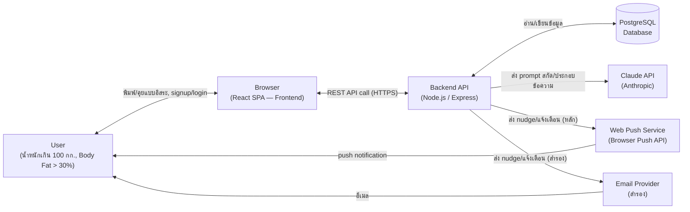
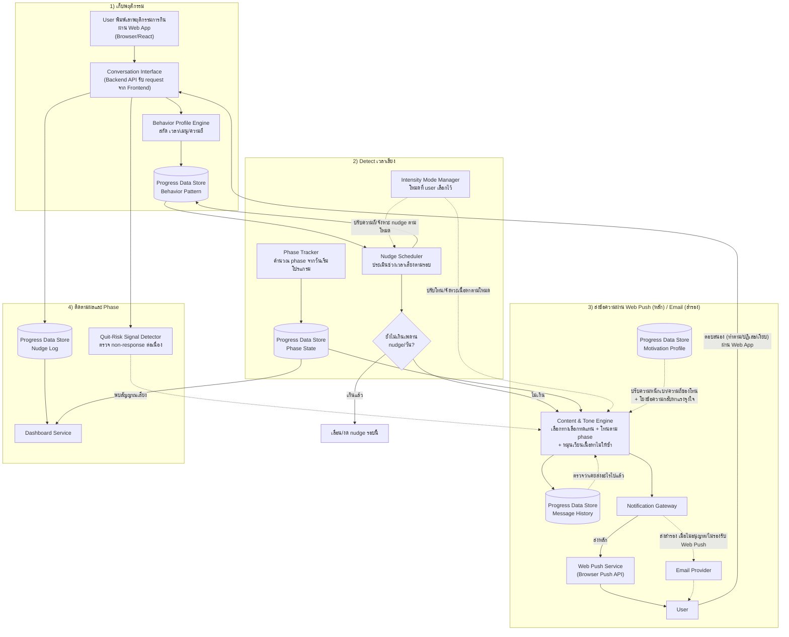
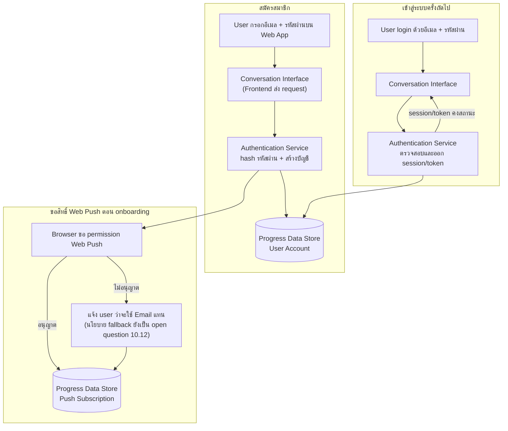
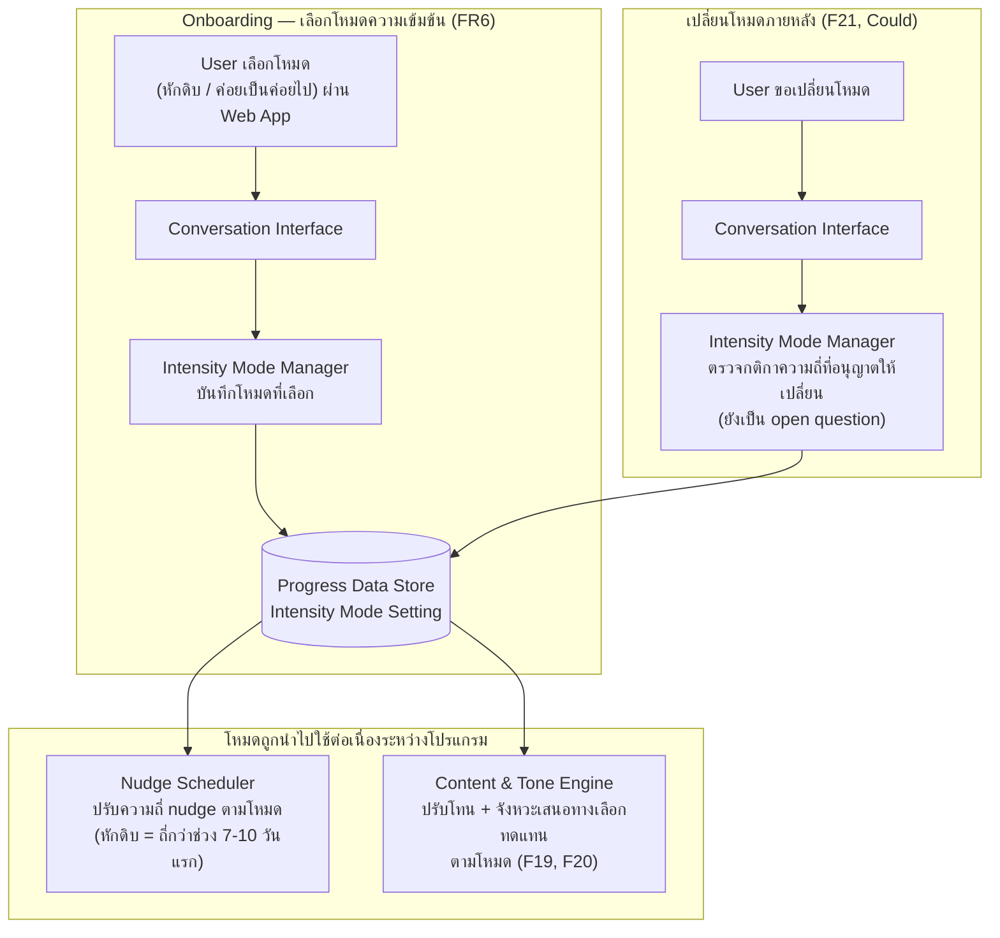
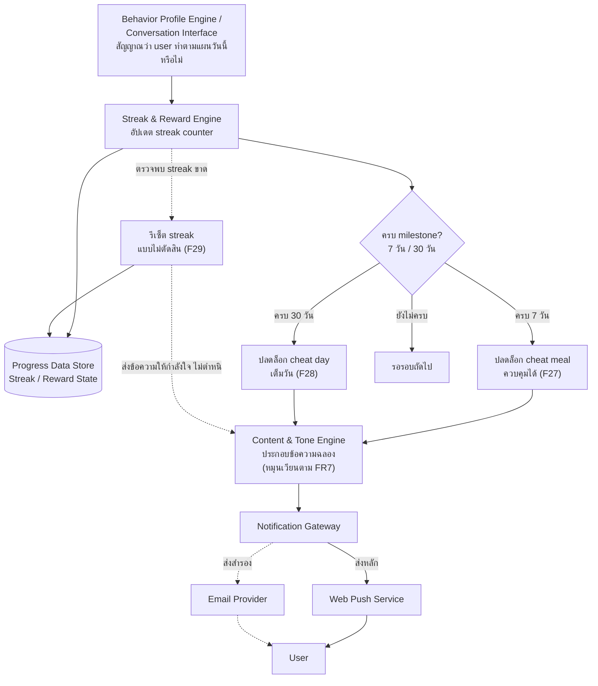
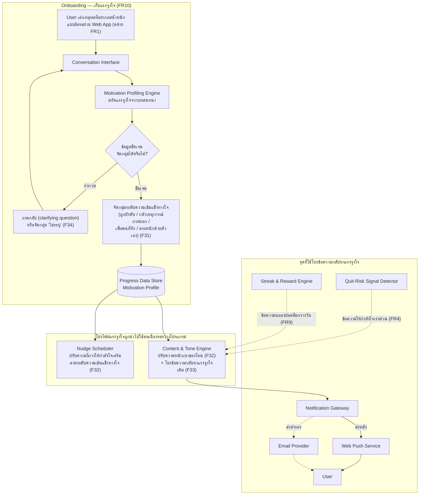

# High Level Architecture — JaiFit

- **สถานะ:** Concrete — ผูกกับ technology stack ที่ตัดสินใจแล้วตาม Confirmed Decision รอบ pivot (2026-08-28 รอบ 3): **Backend: Node.js (Express) · Frontend: React (Vite) · Database: PostgreSQL · AI: Claude API (Anthropic) · Notification: Web Push API (หลัก) + Email (สำรอง) · Authentication: Email/Password + session/token** (กลไก session/token ที่แน่นอนยังเป็น open question 10.13 ของ spec — ดูหัวข้อสมมติฐาน)
- **วันที่จัดทำ:** 2026-08-27
- **ปรับปรุงล่าสุด:** 2026-08-28 — เพิ่ม component/data flow รองรับ FR6-FR9 (Intensity Mode, Message Variety, Proactive Downside Warning, Reward System) ตาม requirement spec และ feature list ที่อัปเดต
- **ปรับปรุงล่าสุด:** 2026-08-28 (รอบ 2) — เพิ่ม component "Motivation Profiling Engine" และ data flow รองรับ FR10 (Motivation Profiling) ตาม requirement spec รอบ 2, backlog Epic 10 และ feature list F30-F34 ที่อัปเดต
- **ปรับปรุงล่าสุด:** 2026-08-28 (รอบ 3 — Pivot ช่องทาง) — เปลี่ยนช่องทางจาก LINE Official Account เป็น **Web App Full-Stack** ตาม Confirmed Decision รอบ 3 ของ requirement spec: ปรับ System Context, Logical Components (เพิ่ม Authentication Service รองรับ FR11, ปรับ Conversation Interface ให้เป็น Web App แทน LINE, ปรับ Notification Gateway ให้ส่งผ่าน Web Push + Email), Data Flow diagrams, Non-Functional Considerations (เพิ่มความปลอดภัยบัญชีผู้ใช้และ deploy จริง) และเปลี่ยนจุดยืนเอกสารจาก "Conceptual ไม่ผูก tech stack" เป็น "Concrete ผูกกับ stack ที่เลือกแล้ว" — แนวคิดฟีเจอร์/data flow เดิมทั้งหมดยังคงไว้เหมือนเดิม ดู [[../../05-log/20260828-03-log|log 2026-08-28 รอบ 3]]
- **ปรับปรุงล่าสุด:** 2026-08-29 (รอบ 4 — ปิด Open Questions) — อัปเดต Authentication Service ให้รองรับ JWT Token + Google Sign-In/Email-Password, เพิ่ม component **Health Screening & Easing Manager** ใหม่ (รองรับ FR12/FR13), อัปเดต Nudge Scheduler & Engine (เพดาน nudge ปรับอัตโนมัติตาม phase, default lead time 15-30 นาที) และ Streak & Reward Engine (grace day 1 วัน), เพิ่ม diagram 4.4 สำหรับ Chronic Condition Screening & Adaptive Symptom Easing, ปรับหัวข้อสมมติฐานให้สะท้อนสถานะปิด Open Question — ดู [[../../05-log/20260829-log|log 2026-08-29]]
- **แปลงมาจาก:** [[../../01-requirements/01-spec/20260827-01-jaifit-ai-coach-metabolic-transition|Requirement Spec]], [[../../01-requirements/backlog|Product Backlog]], [[../../01-requirements/02-plan/20260827-01-feature-list|Feature List]], [[../01-prototypes/20260827-01-user-journey-proactive-nudge|User Journey — Proactive Nudge]]

## 1. System Context

Actor และระบบภายนอกที่มีหลักฐานจริงในเอกสาร requirement หลัง pivot ไป Web App (2026-08-28 รอบ 3) — ช่องทางที่ user ใช้งานเปลี่ยนจาก LINE Platform เป็น Browser (React SPA), และช่องทางส่ง nudge เปลี่ยนเป็น Web Push + Email:

> ระบบ JaiFit ไม่มี actor ภายนอกอื่นที่มีหลักฐานเชิงระบบ (runtime interaction) ในเอกสารต้นทาง — ผู้เชี่ยวชาญด้านโภชนาการ/แพทย์ที่ spec กล่าวถึงทำหน้าที่ตรวจสอบเนื้อหา (phase template, cheat meal) แบบ offline/content authoring ไม่ใช่ actor ที่เรียกใช้ระบบโดยตรงในขอบเขต MVP จึงไม่ใส่เป็น actor ใน system context (ดูหัวข้อสมมติฐาน) — LINE Platform ถูกถอดออกจาก system context นี้แล้ว เพราะไม่ใช้ LINE Official Account อีกต่อไปหลัง pivot (ดู [[../../01-requirements/01-spec/20260827-01-jaifit-ai-coach-metabolic-transition|Requirement Spec]] หัวข้อ 1 และ 5)

## 2. Logical Components

แบ่งระบบเป็น component เชิงหน้าที่ที่ผูกกับ Web App stack ที่เลือกแล้ว (Node.js/Express + React/Vite + PostgreSQL + Claude API) โดยแต่ละตัวต้องมี FR รองรับจริง:

| Component | หน้าที่ | อ้างอิง FR/Feature |
|---|---|---|
| **Authentication Service** | ให้ user สมัครสมาชิก/login ด้วย **Google Sign-In (OAuth)** หรือ **Email/Password** (เลือกได้เอง), ออกและตรวจสอบ **JWT Token** เพื่อคงสถานะระหว่างการใช้งาน, เก็บรหัสผ่านแบบ hashed เฉพาะกรณี Email/Password, ขอสิทธิ์ Web Push จาก browser ตอน onboarding หลัง signup และ fallback ไป Email ทันทีหากไม่อนุญาต (ไม่เพิ่มช่องทางอื่น), เป็นจุด identify user ที่ component อื่นทั้งหมดอ้างอิงแทน LINE user ID เดิม | FR11 (F35, F36, F37, F38) |
| **Health Screening & Easing Manager** | ถาม user ตอน onboarding ว่ามีโรคประจำตัวหรือไม่ (Chronic Condition Screening), แสดง disclaimer แนะนำปรึกษาแพทย์ก่อนเริ่มโปรแกรมถ้ามี (ไม่ block การใช้งาน), รับสัญญาณจาก Behavior Profile Engine/Conversation Interface ว่า user รายงานอาการแย่ลงมากในช่วงวันที่ 1-7 แล้วสั่งให้ Content & Tone Engine ผ่อนปรนปริมาณคาร์บ/น้ำตาลที่แนะนำแทนการหักดิบต่อ (Adaptive Symptom Easing) โดยไม่กระทบ phase timeline ของ Phase Tracker | FR12 (F40, F41, F42), FR13 (F43, F44) |
| **Conversation Interface** | รับ/ส่งข้อความกับ user ผ่านหน้าแชทบน Web App (React frontend เรียก REST API ของ Backend) แทน LINE webhook เดิม, ส่งต่อข้อความเข้า-ออกให้ component อื่นประมวลผล, ให้ user เลือก/ดู/ขอเปลี่ยนโหมดความเข้มข้นผ่าน onboarding flow และ flow เปลี่ยนโหมดภายหลัง, นำบทสนทนาอิสระตอน onboarding เรื่องแรงจูงใจส่งต่อให้ Motivation Profiling Engine | FR1, FR2, FR4, FR6 (F1, F18, F21), FR10 (F30) |
| **Behavior Profile Engine** | สกัด pattern (เวลา/เมนู/ความถี่) จากบทสนทนาอิสระ, สะสมและปรับปรุง behavior profile ต่อเนื่อง, ถามกลับเมื่อข้อมูลกำกวม, เป็นแหล่งสัญญาณ "ทำตามแผนหรือไม่" ให้ Streak & Reward Engine ใช้ประเมิน | FR1 (F2, F3, F4) |
| **Intensity Mode Manager** | เก็บโหมดความเข้มข้นที่ user เลือกตอน onboarding (หักดิบ/ค่อยเป็นค่อยไป), ให้ **เปลี่ยนโหมดได้ตลอดเวลาไม่จำกัดจำนวนครั้ง** แต่ต้องสั่งให้ Content & Tone Engine อธิบายผลลัพธ์ที่จะได้รับให้ user เข้าใจก่อนยืนยันเปลี่ยนทุกครั้ง, เป็นแหล่งอ้างอิงกลางให้ Nudge Scheduler และ Content & Tone Engine ปรับพฤติกรรมตามโหมด | FR6 (F18, F19, F20, F21, F39) |
| **Motivation Profiling Engine** | สกัดแรงจูงใจ/สาเหตุที่ user อยากลดน้ำหนักจากบทสนทนาอิสระตอน onboarding (คล้าย Behavior Profile Engine แต่สกัดคนละมิติข้อมูล), จัดกลุ่มเป็น 4 กลุ่มความเข้มแข็งทางใจเป็นฐาน **โดยมีความยืดหยุ่นปรับระดับจากเนื้อหาบทสนทนาจริงได้ ไม่ยึดติดตายตัว 100%**, ถามกลับเมื่อข้อมูลกำกวมหรือจัดเป็นกลุ่ม "ไม่ระบุ", **ถามทบทวนแรงจูงใจซ้ำเป็นระยะกับ user กลุ่มอ่อนกว่าหลังได้รับ reward จาก Streak & Reward Engine** (กลุ่มเข้มแข็งไม่ถามซ้ำ ใช้ค่าเดิมตลอดโปรแกรม), เป็นแหล่งอ้างอิงกลางให้ Nudge Scheduler และ Content & Tone Engine ปรับความหนักเบา/ความถี่ของโทนให้กำลังใจ และให้ข้อมูลแรงจูงใจเดิมสำหรับการโยงข้อความกลับ | FR10 (F30, F31, F32, F33, F34) |
| **Nudge Scheduler & Engine** | ประเมินช่วงเวลาเสี่ยงของแต่ละ user จาก behavior profile, ตัดสินใจว่าจะส่ง nudge เมื่อไหร่โดย default ส่งล่วงหน้า 15-30 นาทีก่อนเวลาเสี่ยง (user ปรับเองได้ภายหลัง), ตรวจสอบเพดานจำนวน nudge/วันที่**ปรับอัตโนมัติตาม phase ปัจจุบัน** (phase หนักถี่กว่า, phase คงตัวห่างกว่า), ปรับความถี่/จังหวะการเสนอทางเลือกทดแทนตามโหมดความเข้มข้นที่ได้จาก Intensity Mode Manager, และปรับความถี่การให้กำลังใจเสริมตามระดับความเข้มแข็งทางใจที่ได้จาก Motivation Profiling Engine | FR2 (F5, F7, F8), FR6 (F19, F20), FR10 (F32) |
| **Phase Tracker** | นับวันจากวันเริ่มโปรแกรมของ user และ map เข้ากับ phase ตาม fixed calendar template | FR3 (F9) |
| **Content & Tone Engine** | ประกอบเนื้อหาข้อความ (ทางเลือกทดแทน, ข้อความให้กำลังใจ, cheat meal, คำเตือนล่วงหน้าอาการ/สถานการณ์ไม่พึงประสงค์พร้อมวิธีรับมือ) โดยเลือกโทนตาม phase ปัจจุบัน, โหมดความเข้มข้น, และระดับความเข้มแข็งทางใจจาก Motivation Profiling Engine, หมุนเวียน (rotate) เนื้อหา/มุมมอง/คำถามชวนคุยโดยอ้างอิงประวัติข้อความที่เคยส่งแต่ละ user เพื่อไม่ให้ซ้ำติดต่อกันหลายวัน, และโยงข้อความให้กำลังใจ/ฉลองรางวัลกลับไปหาแรงจูงใจเดิมของ user | FR2 (F6), FR3 (F10), FR4 (F12, F14), FR6 (F19, F20), FR7 (F22, F23), FR8 (F24, F25), FR10 (F32, F33) |
| **Quit-Risk Signal Detector** | สังเกตสัญญาณแบบผสมจาก (1) **keyword/sentiment detection** ในบทสนทนา และ (2) **พฤติกรรมไม่ตอบสนอง nudge ติดต่อกันหลายครั้ง** ที่บ่งชี้ว่า user ใกล้ล้มเลิก แล้ว trigger ข้อความให้กำลังใจเร่งด่วน | FR4 (F13) |
| **Streak & Reward Engine** | นับ streak วันต่อเนื่องที่ user ทำตามแผน (อิงสัญญาณจาก Behavior Profile Engine/Conversation Interface), ให้ streak **พักได้ 1 วันโดยไม่ถูกตัด (grace day)** ก่อนจะรีเซ็ตจริง, ตรวจสอบเมื่อครบ milestone (7 วัน / 30 วัน), ปลดล็อกสิทธิ์ cheat meal/cheat day, สั่งให้ Content & Tone Engine ประกอบข้อความฉลองความสำเร็จ (โยงกลับไปหาแรงจูงใจเดิมได้ผ่าน Motivation Profiling Engine และเป็นจังหวะที่เหมาะสมให้ Motivation Profiling Engine ถามทบทวนแรงจูงใจซ้ำกับ user กลุ่มอ่อนกว่า), และรีเซ็ต streak แบบไม่ตัดสินเมื่อ streak ขาดเกิน grace day | FR9 (F26, F27, F28, F29), FR10 (F33) |
| **Notification Gateway** | ส่งข้อความออกไปยัง user ผ่าน **Web Push Notification เป็นช่องทางหลัก** (Browser Push API + Service Worker) และ **Email เป็นช่องทางสำรอง** (เมื่อ user ไม่อนุญาต Web Push หรือ browser/อุปกรณ์ไม่รองรับ) แทน LINE Messaging API เดิม — ครอบคลุม nudge, ข้อความให้กำลังใจ, คำเตือนล่วงหน้า, ข้อความฉลอง reward | FR2, FR4, FR8, FR9, FR11 |
| **Progress Data Store** | เก็บ behavior profile, nudge log, phase state, consent, โหมดความเข้มข้นที่เลือกไว้, motivation profile และระดับความเข้มแข็งทางใจ, ประวัติข้อความที่เคยส่งต่อ user (สำหรับหมุนเวียนเนื้อหา), สถานะ streak/reward (รวม grace day), ผลคัดกรองโรคประจำตัวและสถานะการผ่อนปรนตามอาการ (FR12/FR13), และบัญชี user (อีเมล/hashed password หรือ Google account reference, สิทธิ์ Web Push ที่ผูกไว้) — implement บน **PostgreSQL** ตาม stack ที่เลือก เป็นข้อมูลที่ component ต่าง ๆ ต้องใช้ร่วมกัน | รองรับ FR1-FR13 ทั้งหมด |
| **Dashboard Service** | รวบรวมข้อมูลจาก Progress Data Store เพื่อแสดง phase ปัจจุบัน, weekly summary, และ trend พฤติกรรมเสี่ยง | FR5 (F15, F16, F17) |

## 3. Data Flow — Journey "Proactive Nudge"

แสดงข้อมูลไหลผ่าน component ต่าง ๆ ตาม [[../01-prototypes/20260827-01-user-journey-proactive-nudge|User Journey — Proactive Nudge ก่อนเวลาเสี่ยง]] ครอบคลุมตั้งแต่การเก็บพฤติกรรม → detect เวลาเสี่ยง → ส่งข้อความผ่าน Web Push/Email → ติดตาม phase (journey เดิมออกแบบไว้ตอนช่องทางยังเป็น LINE — diagram ด้านล่างปรับ node ที่เป็นช่องทางให้ตรงกับ pivot รอบ 3 แล้ว logic/ลำดับ data flow อื่นคงเดิม):

## 4. Data Flow เพิ่มเติม — Signup/Login, Intensity Mode, Reward System & Motivation Profiling

> ยังไม่มี user journey document เฉพาะสำหรับ signup/login, onboarding (เลือกโหมดความเข้มข้น, เก็บแรงจูงใจ) และ Reward System ใน `docs/02-design/01-prototypes/` ณ ตอนที่จัดทำ diagram นี้ — diagram ด้านล่างจึงเป็นการแปลง FR6/FR9/FR10/FR11 โดยตรงในระดับ "ข้อมูลไหลผ่าน component ไหนบ้าง" เท่านั้น แนะนำให้รัน `/feature-journey` เพิ่มเติมเพื่อยืนยัน flow ระดับละเอียดภายหลัง (ดูหัวข้อสมมติฐาน)

### 4.0 Signup/Login & ขอสิทธิ์ Web Push (FR11)

### 4.1 Intensity Mode ส่งผลต่อ Nudge Scheduler และ Content & Tone Engine

### 4.2 Reward System — ตรวจ Streak → ปลดล็อก → แจ้ง User

### 4.3 Motivation Profiling — เก็บตอน Onboarding → จัดกลุ่ม → ปรับโทน/ความถี่ → โยงกลับหาแรงจูงใจ (FR10)

### 4.4 Chronic Condition Screening & Adaptive Symptom Easing (FR12, FR13)

```mermaid
flowchart TD
    subgraph Onboard["Onboarding — คัดกรองโรคประจำตัว (FR12)"]
        U1["User ตอบคำถามโรคประจำตัว<br/>ผ่าน Web App"] --> CI["Conversation Interface"]
        CI --> HSE["Health Screening & Easing Manager"]
        HSE --> DS1[("Progress Data Store<br/>Chronic Condition Flag")]
        HSE --> HAS{"มีโรคประจำตัวหรือไม่?"}
        HAS -- "มี" --> DISC["แสดง disclaimer แนะนำ<br/>ปรึกษาแพทย์ก่อนเริ่ม (ไม่ block)"]
        HAS -- "ไม่มี" --> START["เริ่มโปรแกรมได้ตามปกติ"]
        DISC --> START
    end

    subgraph Ease["ผ่อนปรนตามอาการช่วงวันที่ 1-7 (FR13)"]
        U2["User รายงานอาการแย่ลงมาก<br/>ผ่านบทสนทนาอิสระ (เหมือน FR1)"] --> CI2["Conversation Interface"]
        CI2 --> BPE["Behavior Profile Engine<br/>ส่งสัญญาณความรุนแรงของอาการ"]
        BPE --> HSE2["Health Screening & Easing Manager<br/>ประเมินว่าเข้าเงื่อนไขผ่อนปรนหรือไม่"]
        HSE2 -- "เข้าเงื่อนไข" --> CTE["Content & Tone Engine<br/>ผ่อนปรนปริมาณคาร์บ/น้ำตาลที่แนะนำ<br/>+ อธิบายผลลัพธ์ที่ช้าลงแต่ปลอดภัยกว่า"]
        HSE2 -.->|"ไม่กระทบ"| PT["Phase Tracker<br/>(phase timeline ไม่เปลี่ยน)"]
        CTE --> DS2[("Progress Data Store<br/>Easing State")]
    end
```

## 5. Non-Functional Considerations

อ้างอิงหัวข้อ NFR ในเอกสาร spec ต้นทาง (รวม NFR ที่เพิ่มจาก pivot รอบ 3 — ความปลอดภัยบัญชีผู้ใช้, deploy จริง) แปลงเป็นข้อควรพิจารณาเชิง capability โดยผูกกับ stack ที่ตัดสินใจแล้ว (Node.js/Express, React/Vite, PostgreSQL, Claude API, Web Push/Email):

| NFR ต้นทาง | Component ที่เกี่ยวข้อง | ข้อควรพิจารณาเชิง capability |
|---|---|---|
| ความเป็นส่วนตัวของข้อมูลสุขภาพ (PDPA) | Progress Data Store, Behavior Profile Engine, Motivation Profiling Engine | ต้องมีกลไกขอ/บันทึก consent ก่อนเก็บข้อมูล และควบคุมสิทธิ์การเข้าถึงข้อมูลอ่อนไหว (น้ำหนัก, Body Fat, พฤติกรรมการกิน, streak/reward state, แรงจูงใจ/เหตุผลส่วนตัวที่อาจเป็นข้อมูลอ่อนไหวเชิงจิตใจ) |
| Disclaimer ทางการแพทย์ | Content & Tone Engine, Conversation Interface | ต้องมีกลไกแนบ/แสดง disclaimer ในจุดที่เหมาะสม (เช่น onboarding, ข้อความ cheat meal, ข้อความเตือนล่วงหน้าอาการ) |
| ความแม่นยำของเวลา nudge | Nudge Scheduler & Engine, Intensity Mode Manager | ต้องมี mechanism ประเมินเวลาซ้ำในรอบที่ถี่พอจะส่งทันภายใน window ที่ยอมรับได้ และต้องอ่านค่าโหมดความเข้มข้นให้ทันก่อนตัดสินใจแต่ละรอบ (ค่าจริงยังเป็น open question) |
| Availability ของช่องทางส่งข้อความและ web hosting | Notification Gateway | ต้องรองรับความล้มเหลวชั่วคราวของ Web Push Service และ Email Provider เช่น mechanism retry/fallback ระหว่างสองช่องทาง (Web Push → Email ตาม FR2) และต้องพึ่งพา availability ของ Backend API/Frontend hosting ของ JaiFit เองที่ deploy จริง เนื่องจากไม่มี platform กลาง (เช่น LINE) มารองรับความเสถียรของการส่งข้อความให้อีกต่อไป |
| ความปลอดภัยของบัญชีผู้ใช้ | Authentication Service, Progress Data Store | ต้องมี capability เก็บรหัสผ่านแบบ hashed (ไม่เก็บ plain text), บังคับให้การเชื่อมต่อระหว่าง Frontend-Backend เป็น HTTPS, และกำหนดอายุ (expiry) ของ session/token ที่เหมาะสม เพราะระบบระบุตัวตน user ด้วยบัญชีของ JaiFit เองแทนการอิง LINE identity เดิม |
| Deploy ใช้งานได้จริง | ทุก component (Frontend, Backend, Progress Data Store) | ต้องมี capability deploy Frontend, Backend, และ Database ให้เข้าถึงได้ผ่านอินเทอร์เน็ตจริง ไม่ใช่รันบน local เท่านั้น ตามข้อกำหนดหลักสูตร — รายละเอียด hosting/environment เป็นการตัดสินใจของทีมเทคนิคในขั้นถัดไป |
| ความน่าเชื่อถือของเนื้อหาที่กระทบสุขภาพ (phase template, คำเตือนอาการ, เมนู cheat meal) | Content & Tone Engine | เนื้อหาที่ใช้ประกอบข้อความ (รวมคำเตือนล่วงหน้าตาม FR8) ต้องมาจากแหล่งที่ผ่านการตรวจสอบ/validate ได้ ไม่ใช่การเดาเอง — ต้องมี capability แยกแยะ "เนื้อหาที่ validate แล้ว" กับ "สมมติฐานชั่วคราว" |
| ความยุติธรรม/ความสม่ำเสมอของการนับ streak | Streak & Reward Engine | ต้องมี capability บันทึกเหตุผล/หลักฐานที่ใช้ตัดสินว่า streak ขาดหรือไม่ เพื่อให้ตรวจสอบย้อนหลังได้และลดโอกาสที่ user รู้สึกว่าระบบนับผิด/ไม่เป็นธรรม |
| ความไม่ซ้ำซากของเนื้อหา (message variety) | Content & Tone Engine, Progress Data Store | ต้องมี capability เก็บและ query ประวัติข้อความ/เมนูที่เคยส่งต่อ user แต่ละคนได้เพียงพอที่จะตรวจสอบการซ้ำในช่วงเวลาที่กำหนด |
| ความน่าเชื่อถือของการจัดกลุ่มแรงจูงใจ (Motivation Profiling) | Motivation Profiling Engine | เกณฑ์จัดกลุ่มระดับความเข้มแข็งทางใจยังไม่ผ่านการ validate จากผู้เชี่ยวชาญ (นักจิตวิทยา/behavior change) ต้องมี capability แยกแยะ "เกณฑ์ที่ validate แล้ว" กับ "สมมติฐานชั่วคราวจากประสบการณ์ผู้ก่อตั้ง" เช่นเดียวกับเนื้อหา phase/คำเตือนล่วงหน้า และต้องปรับเกณฑ์ได้ในอนาคตโดยไม่กระทบข้อมูลที่เก็บไว้แล้ว |

## 6. สมมติฐาน/คำถามที่ต้องยืนยัน

- **ผู้เชี่ยวชาญด้านโภชนาการ/แพทย์** ไม่ได้ใส่เป็น actor ใน system context เพราะเอกสารต้นทางไม่ได้ระบุว่ามี interaction เชิงระบบ (เช่น หน้า admin ให้แก้ phase template) เป็นเพียงกระบวนการ validate เนื้อหาแบบ offline — ถ้าในอนาคตต้องมีช่องทางให้ผู้เชี่ยวชาญแก้ไข phase/cheat meal content ผ่านระบบจริง ต้องเพิ่ม actor และ component (เช่น Content Management) เข้ามาใหม่
- **Nudge Scheduler & Engine** ถูกวาดเป็น component ที่ "ประเมินตามรอบ" (polling-style) เป็นแนวคิดหนึ่งที่เป็นไปได้เท่านั้น ยังไม่ได้ยืนยันว่าระบบจริงบน Node.js/Express ควร implement เป็น scheduled job (เช่น cron ภายใน backend) หรือ event-driven — เป็นรายละเอียดเชิงเทคนิคที่ควรตัดสินใจในเอกสาร detailed design ถัดไป
- **Quit-Risk Signal Detector** เชื่อมเข้ากับ Content & Tone Engine โดยตรงตามภาพ data flow — วิธี detect ยืนยันแล้วว่าใช้แบบผสม (keyword/sentiment + engagement pattern, เดิม open question 10.2 ปิดแล้ว) แต่จำนวนครั้ง "ไม่ตอบสนองต่อเนื่อง" ที่แน่นอนยังต้องกำหนดตอน implement
- **Progress Data Store** ถูกวาดเป็น component เดียวเพื่อความง่ายในระดับ high-level แม้ยืนยันแล้วว่า implement บน PostgreSQL แต่ยังไม่ได้ออกแบบว่าจะแยกเป็นกี่ตาราง/schema ตามลักษณะข้อมูล (behavior pattern, nudge log, phase state, intensity mode, message history, streak/reward state, user account) — เป็นรายละเอียดของ database schema design ที่ควรทำในเอกสาร detailed design/API-DB ถัดไป ไม่ใช่ระดับ high-level architecture
- **Intensity Mode Manager และ Streak & Reward Engine** ไม่มี user journey document เฉพาะรองรับใน `docs/02-design/01-prototypes/` ณ ตอนที่จัดทำ diagram นี้ (มีเฉพาะ journey "Proactive Nudge") — data flow ในหัวข้อ 4 จึงแปลงมาจาก FR6/FR9 โดยตรง ยังไม่ผ่านการยืนยันระดับ interaction ละเอียด แนะนำให้รัน `/feature-journey` เพิ่มเติมสำหรับ journey "Onboarding — เลือกโหมดความเข้มข้น" และ "Reward Unlock" ก่อนเข้าสู่ detailed design
- **กติกาการเปลี่ยนโหมดความเข้มข้นภายหลัง (F21)** ยืนยันแล้ว (เดิม open question 10.6): เปลี่ยนได้ตลอดเวลาไม่จำกัดจำนวนครั้ง โดยต้องผ่าน Content & Tone Engine อธิบายผลลัพธ์ให้ user เข้าใจก่อนเปลี่ยนทุกครั้ง (F39) — diagram หัวข้อ 4.1 ยังไม่ได้อัปเดตให้วาด flow นี้โดยละเอียด ควรเพิ่มในรอบถัดไป
- **กติกาการนับ/รีเซ็ต streak (FR9)** ยืนยันแล้ว (เดิม open question 10.9): ให้ streak พักได้ 1 วันโดยไม่ถูกตัด (grace day) ก่อนจะรีเซ็ตจริง — Streak & Reward Engine ในหัวข้อ 4.2 ยังวาด logic แบบง่าย (ตรวจ milestone → ปลดล็อก, ตรวจ streak ขาด → reset ทันที) ที่ยังไม่รวม branch ของ grace day โดยตรง ควรปรับปรุงใน detailed design
- **กลไกหมุนเวียนเนื้อหา (Message Variety, FR7)** ยืนยันแล้ว (เดิม open question 10.7): ใช้แบบผสม — content library เป็นฐาน แล้วให้ AI ปรับถ้อยคำ/มุมมองให้เข้ากับ context ของ user แต่ละคน — เอกสารนี้วาด Content & Tone Engine ว่า "อ้างอิงประวัติข้อความเพื่อไม่ให้ซ้ำ" ในระดับ capability ซึ่งสอดคล้องกับกลไกที่ยืนยันแล้ว
- **แหล่งที่มาของเนื้อหาคำเตือนล่วงหน้า (FR8)** ยืนยันแล้ว (เดิม open question 10.8): ใช้สมมติฐานผู้ก่อตั้งไปก่อนใน MVP แล้วปรับตาม feedback จริงภายหลัง เช่นเดียวกับตาราง phase ในหัวข้อ 10.4 — Content & Tone Engine ยังคงต้องมี capability แยก "เนื้อหาที่ validate แล้ว" ออกจาก "สมมติฐานชั่วคราว" ตามที่ระบุในหัวข้อ NFR เพราะ MVP ยังไม่ผ่านการ validate จริง
- **ความสัมพันธ์ระหว่าง Streak & Reward Engine กับ Quit-Risk Signal Detector** ยังไม่ชัดเจนว่าสัญญาณ quit-risk (FR4) ควรทำให้ streak หยุดนับชั่วคราวหรือไม่ หรือเป็นคนละ mechanism แยกกันโดยสิ้นเชิง — diagram ในหัวข้อ 4.2 ยังไม่ได้เชื่อมสอง component นี้เข้าด้วยกัน ต้องยืนยันเพิ่มเติม
- **การจัดกลุ่มระดับความเข้มแข็งทางใจ (FR10, Motivation Profiling Engine)** ยืนยันแล้ว (เดิม open question 10.10): ใช้ 4 กลุ่มจากประสบการณ์ผู้ก่อตั้งเป็นฐาน แต่ AI มีความยืดหยุ่นประเมินจากบทสนทนาจริงได้ ไม่ยึดติดตายตัว 100% — ยังไม่ผ่านการ validate จากนักจิตวิทยา/ผู้เชี่ยวชาญด้าน behavior change เป็นทางการ diagram หัวข้อ 4.3 ยังต้องปรับปรุงให้แสดง logic การปรับระดับแบบยืดหยุ่นนี้ในรอบ detailed design ถัดไป
- **ควรถาม/ทบทวนแรงจูงใจของ user ซ้ำหลัง onboarding หรือไม่ (FR10)** ยืนยันแล้ว (เดิม open question 10.11): กลุ่มแรงจูงใจเข้มแข็ง (เพื่อคนที่รัก, ตระหนักด้วยตัวเอง) ไม่ถามซ้ำ — กลุ่มอ่อนกว่า (ถูกบังคับ, กลัวจากข่าว) ถามทบทวนเป็นระยะ โดยจังหวะที่เหมาะสมคือหลัง user ได้รับ reward จาก Streak & Reward Engine (FR9) — diagram หัวข้อ 4.3 ยังต้องเพิ่มเส้นเชื่อมจาก Streak & Reward Engine กลับเข้า Motivation Profiling Engine เพื่อรองรับ loop การถามทบทวนนี้ในรอบ detailed design ถัดไป
- **Motivation Profiling Engine กับ Behavior Profile Engine** ถูกวาดเป็น component แยกกัน (แม้ทั้งคู่สกัดข้อมูลจากบทสนทนาอิสระตอน onboarding/ระหว่างทางคล้ายกัน) เพราะสกัดคนละมิติข้อมูลและมี consumer ต่างกัน (Behavior Profile Engine ป้อน Nudge Scheduler เรื่องเวลา/เมนูเสี่ยง ส่วน Motivation Profiling Engine ป้อนเรื่องโทน/ความถี่การให้กำลังใจ) — เป็นการตัดสินใจเชิงตรรกะที่ทีมเทคนิคอาจรวมเป็น service เดียวกันภายใน Backend เดียวกันได้ในขั้นตอน detailed design ถ้าเห็นว่าเหมาะสมกว่า
- **นโยบาย fallback เมื่อ user ไม่อนุญาต Web Push (FR2, FR11)** ยืนยันแล้ว (เดิม open question 10.12): ใช้ Email เป็นช่องทางหลักทันทีแบบไม่ถามซ้ำ ไม่เพิ่มช่องทางอื่นนอกเหนือ Web Push/Email — diagram หัวข้อ 4.0 วาด Authentication Service เป็นจุดตรวจสิทธิ์ Web Push และ fallback ไป Email ตรงกับนโยบายที่ยืนยันแล้ว
- **กลไก authentication/session ที่แน่นอน (FR11)** ยืนยันแล้ว (เดิม open question 10.13): ใช้ **JWT Token** เป็นกลไกหลัก และรองรับ 2 วิธีสมัคร/เข้าสู่ระบบ — **Google Sign-In (OAuth)** และ **Email/Password** ให้ user เลือกได้เอง ไม่ใช้บริการ Auth สำเร็จรูปจาก third-party — รายละเอียด token expiry/refresh flow ยังต้องกำหนดในเอกสาร detailed design/API design ถัดไป
- **Web App SPA (React) กับ Backend API (Node.js/Express)** ในเอกสารนี้วาดเป็นสอง process แยกกันสื่อสารผ่าน REST API เป็นสถาปัตยกรรมที่สอดคล้องกับ Confirmed Decision ของ spec และแนวทางที่ Module 2 ของหลักสูตรมักสอน แต่รายละเอียดการแบ่ง route/endpoint, การจัดการ CORS, และ deployment topology (เช่น deploy Frontend/Backend รวมหรือแยก host) ยังไม่ได้ตัดสินใจ ณ ระดับ high-level นี้ ต้องยืนยันในเอกสาร detailed design/API-DB ถัดไป
