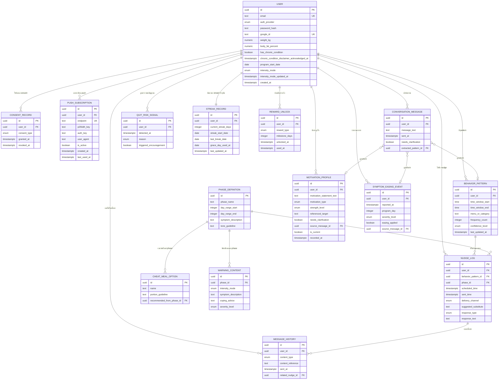

# Database Schema — JaiFit

- **สถานะ:** Concrete — ผูกกับ **PostgreSQL** จริงตามการตัดสินใจ tech stack ของโปรเจกต์ (Node.js + Express backend, React frontend, PostgreSQL database) ประเภทข้อมูลด้านล่างระบุเป็น PostgreSQL type จริง ไม่ใช่เชิงแนวคิดอีกต่อไป
- **วันที่จัดทำ:** 2026-08-27
- **ปรับปรุงล่าสุด:** 2026-08-28 (รอบ 3 — Pivot สู่ Web App) — เปลี่ยนจุดยืนจาก "Conceptual ไม่ผูก tech stack" เป็น "ผูกกับ PostgreSQL" แปลงประเภทข้อมูลทุก entity เป็น PostgreSQL type จริง, เพิ่ม `email`/`password_hash` ใน `User` และเอา `line_user_id` ออก (รองรับ FR11), เพิ่ม entity ใหม่ `PushSubscription` (รองรับ FR11/FR2 — Web Push) — เหตุผล pivot ดู [[../../01-requirements/01-spec/20260827-01-jaifit-ai-coach-metabolic-transition|Requirement Spec]] หัวข้อ 1 และ 5 (Confirmed Decisions รอบ 3)
- **ปรับปรุงล่าสุด:** 2026-08-29 (รอบ 4 — ปิด Open Questions) — `User`: เพิ่ม `auth_provider`/`google_id` รองรับ Google Sign-In (`password_hash` เปลี่ยนเป็น nullable), เพิ่ม `has_chronic_condition`/`chronic_condition_disclaimer_acknowledged_at` รองรับ FR12; เพิ่ม entity ใหม่ `SymptomEasingEvent` รองรับ FR13; `StreakRecord` เพิ่ม `grace_day_used_at` รองรับกติกา grace day ของ FR9 — ดู [[../../05-log/20260829-log|log 2026-08-29]]
- **แปลงมาจาก:** [[../../01-requirements/02-plan/20260827-01-feature-list|Feature List]], [[20260827-01-high-level-architecture|High Level Architecture]]

รองรับฟีเจอร์หลักใน Feature List: สมัครสมาชิก/เข้าสู่ระบบ (FR11), เก็บพฤติกรรมการกิน (F1-F4), Nudge Engine (F5-F8), Phase Tracking (F9-F11), กำลังใจ/Cheat Meal (F12-F14), Dashboard (F15-F17), Intensity Mode (F18-F21, F39), Message Variety (F22-F23), Proactive Downside Warning (F24-F25), Reward System (F26-F29), Motivation Profiling (F30-F34), Chronic Condition Screening (F40-F42), Adaptive Symptom Easing (F43-F44)

> หมายเหตุ: ทีมเทคนิคยังสามารถเลือกใช้ PostgreSQL native `ENUM` type (`CREATE TYPE ... AS ENUM (...)`) หรือ `TEXT` + `CHECK` constraint แทนกันได้สำหรับทุก field ที่ระบุเป็น `ENUM(...)` ด้านล่าง — เอกสารนี้ระบุค่าที่อนุญาต (allowed values) เป็นหลัก ไม่ได้ฟันธง implementation choice ระหว่างสองแนวทางนี้

## 1. รายการ Entity

| Entity | คำอธิบาย | รองรับฟีเจอร์ |
|---|---|---|
| `User` | ข้อมูลบัญชีผู้ใช้ (อีเมล/รหัสผ่าน), ข้อมูลผู้ใช้และ consent ระดับบัญชี รวมถึงโหมดความเข้มข้นที่เลือก | FR11, F1-F29 (ทุกฟีเจอร์อ้างอิงถึง user) |
| `ConsentRecord` | บันทึกการขอ/ถอน consent การเก็บข้อมูลส่วนบุคคล/สุขภาพ (audit trail ตาม PDPA) | NFR ความเป็นส่วนตัว (spec หัวข้อ 9) |
| `PushSubscription` | เก็บ Web Push subscription ของ browser ที่ user อนุญาตให้ส่งการแจ้งเตือน ใช้เป็นช่องทางหลักของ nudge/ข้อความให้กำลังใจ | FR11, FR2 |
| `ConversationMessage` | log ข้อความดิบที่ user พิมพ์เข้ามา รวมสถานะว่าต้องถามกลับหรือไม่ | F1, F3 |
| `BehaviorPattern` | pattern พฤติกรรมที่สกัดได้ (เวลา/เมนู/ความถี่) ต่อ user | F2, F4 |
| `PhaseDefinition` | ตาราง reference ของ phase เปลี่ยนระบบเผาผลาญ (ช่วงวัน, อาการ, โทนข้อความ) — ไม่ผูกกับ user รายคน | F9, F10 |
| `NudgeLog` | บันทึกทุกครั้งที่ระบบส่ง/พยายามส่ง nudge พร้อมผลตอบสนอง | F5-F8, F16, F17 |
| `QuitRiskSignal` | บันทึกการตรวจพบสัญญาณใกล้ล้มเลิกของ user | F13 |
| `CheatMealOption` | รายการเมนู/ปริมาณ cheat meal ที่ควบคุมได้ อ้างอิง phase ที่เหมาะสม | F14, F27 (ใช้ปลดล็อกรางวัล) |
| `MessageHistory` | log เนื้อหา/เมนู/ข้อความทุกประเภทที่เคยส่งให้ user แต่ละคน ใช้หมุนเวียนเนื้อหาไม่ให้ซ้ำ | F22, F23 |
| `WarningContent` | รายการอาการ/สถานการณ์ไม่พึงประสงค์ที่อาจเกิดขึ้น พร้อมวิธีรับมือ อ้างอิง phase และ intensity mode | F24, F25 |
| `StreakRecord` | สถานะ streak วันต่อเนื่องปัจจุบันของ user (1 ต่อ 1 user) | F26, F29 |
| `RewardUnlock` | บันทึกรางวัล (cheat meal/cheat day) ที่ user ปลดล็อกได้จาก milestone ของ streak | F27, F28 |
| `MotivationProfile` | บันทึกแรงจูงใจ/สาเหตุที่ user อยากลดน้ำหนัก ที่สกัดได้จากบทสนทนา พร้อมระดับความเข้มแข็งทางใจที่จัดกลุ่มได้ ใช้ปรับความถี่/โทนการให้กำลังใจและโยงข้อความกลับไปหาแรงจูงใจเดิม | F30-F34 |
| `SymptomEasingEvent` | บันทึกครั้งที่ user รายงานอาการแย่ลงมากในช่วงวันที่ 1-7 และผลการประเมินว่าระบบผ่อนปรนปริมาณคาร์บ/น้ำตาลให้หรือไม่ | F43, F44 |

## 2. รายละเอียด Field ต่อ Entity

### `User`
| Field | ประเภท (PostgreSQL) | จำเป็น | คำอธิบาย |
|---|---|---|---|
| id | UUID (PK, DEFAULT gen_random_uuid()) | ใช่ | รหัสอ้างอิงผู้ใช้ในระบบ |
| email | TEXT (UNIQUE) | ใช่ | อีเมลที่ใช้สมัครสมาชิก/เข้าสู่ระบบ (FR11) — ใช้ทั้งกรณี Email/Password และ Google Sign-In (Google บังคับให้มีอีเมลเสมอ) |
| auth_provider | ENUM(`email_password`, `google`) | ใช่ | วิธีสมัคร/เข้าสู่ระบบที่ user เลือก (ยืนยันแล้ว — เดิม open question 10.13) |
| password_hash | TEXT | ไม่ | รหัสผ่านที่เข้ารหัสแบบ hashed (เช่น bcrypt/argon2) ห้ามเก็บ plain text — **จำเป็นเฉพาะเมื่อ `auth_provider = email_password`** (null เมื่อสมัครด้วย Google) (FR11, NFR ความปลอดภัยบัญชีผู้ใช้) — 🔒 ข้อมูลอ่อนไหวด้านความปลอดภัย |
| google_id | TEXT (UNIQUE) | ไม่ | Google account ID ที่ผูกกับบัญชีนี้ — **จำเป็นเฉพาะเมื่อ `auth_provider = google`** (null เมื่อสมัครด้วย Email/Password) |
| weight_kg | NUMERIC(5,2) | ใช่ | น้ำหนักปัจจุบัน (กก.) — 🔒 ข้อมูลสุขภาพอ่อนไหว |
| body_fat_percent | NUMERIC(4,1) | ใช่ | Body Fat % — 🔒 ข้อมูลสุขภาพอ่อนไหว |
| has_chronic_condition | BOOLEAN | ใช่ | ผลคัดกรองตอน onboarding ว่า user มีโรคประจำตัว (ความดัน, เบาหวาน ฯลฯ) หรือไม่ (FR12) — 🔒 ข้อมูลสุขภาพอ่อนไหว |
| chronic_condition_disclaimer_acknowledged_at | TIMESTAMPTZ | ไม่ | เวลาที่ user รับทราบ disclaimer แนะนำปรึกษาแพทย์ (null ถ้า `has_chronic_condition = false` หรือยังไม่รับทราบ) (FR12) |
| program_start_date | DATE | ใช่ | วันที่เริ่มโปรแกรม ใช้คำนวณ phase (fixed calendar) |
| intensity_mode | ENUM(`fast_track`, `gradual`) | ใช่ | โหมดความเข้มข้นที่ user เลือกตอน onboarding มีผลต่อความถี่ nudge, จังหวะเสนอทางเลือกทดแทน, และโทนเนื้อหา (FR6) |
| intensity_mode_updated_at | TIMESTAMPTZ | ไม่ | เวลาที่เปลี่ยนโหมดล่าสุด — เปลี่ยนได้ไม่จำกัดจำนวนครั้ง (ยืนยันแล้ว — เดิม open question 10.6) ใช้ field นี้เพื่อบันทึกประวัติล่าสุดเท่านั้น ไม่ใช่เพื่อจำกัดความถี่ |
| created_at | TIMESTAMPTZ (DEFAULT now()) | ใช่ | วันที่สร้างบัญชี |

> ⚠️ **Constraint เชิงตรรกะที่ต้องบังคับที่ application layer** (PostgreSQL `CHECK` constraint ทำได้เช่นกัน): `auth_provider = 'email_password'` ⇒ `password_hash IS NOT NULL AND google_id IS NULL`; `auth_provider = 'google'` ⇒ `google_id IS NOT NULL AND password_hash IS NULL`

> ⚠️ **`line_user_id` ถูกเอาออกจาก entity นี้** เทียบกับเวอร์ชันก่อน pivot — เดิมใช้เชื่อมข้อความเข้า-ออกกับ LINE Messaging API แต่หลัง pivot ไป Web App เต็มรูปแบบ (FR11) ระบบระบุตัวตนผู้ใช้ด้วย `email` + `password_hash` แทน ไม่มี dependency กับ LINE platform อีกต่อไป — ถ้าในอนาคตต้องการเชื่อมกลับไปยัง LINE (เช่น เป็นช่องทางแจ้งเตือนเสริมอีกช่องทาง) ควรเพิ่มเป็น entity/field แยกต่างหาก ไม่ผูกกับ identity หลักของบัญชี

### `ConsentRecord`
| Field | ประเภท (PostgreSQL) | จำเป็น | คำอธิบาย |
|---|---|---|---|
| id | UUID (PK) | ใช่ | รหัส record |
| user_id | UUID (FK → User.id) | ใช่ | เจ้าของ consent |
| consent_type | ENUM(`data_collection`, `health_data`) | ใช่ | ประเภทของ consent ที่ขอ |
| granted_at | TIMESTAMPTZ | ใช่ | เวลาที่ user ให้ consent |
| revoked_at | TIMESTAMPTZ | ไม่ | เวลาที่ user ถอน consent (null ถ้ายังไม่ถอน) |

### `PushSubscription`
| Field | ประเภท (PostgreSQL) | จำเป็น | คำอธิบาย |
|---|---|---|---|
| id | UUID (PK) | ใช่ | รหัส subscription |
| user_id | UUID (FK → User.id) | ใช่ | เจ้าของ subscription |
| endpoint | TEXT (UNIQUE) | ใช่ | URL endpoint ของ push service ที่ browser สร้างให้ (จาก `PushSubscription` object ฝั่ง browser) |
| p256dh_key | TEXT | ใช่ | public key สำหรับเข้ารหัสข้อความ push (จาก `subscription.keys.p256dh`) |
| auth_key | TEXT | ใช่ | auth secret สำหรับเข้ารหัสข้อความ push (จาก `subscription.keys.auth`) — 🔒 ข้อมูลอ่อนไหวด้านความปลอดภัย (ใช้ในการส่ง push ที่ระบุตัวอุปกรณ์ผู้ใช้) |
| user_agent | TEXT | ไม่ | ข้อมูล browser/device ที่ลงทะเบียน (เพื่อ debug/แสดงรายการอุปกรณ์ให้ user จัดการ) |
| is_active | BOOLEAN (DEFAULT true) | ใช่ | subscription นี้ยังใช้งานได้อยู่หรือไม่ (ปิดเมื่อ push ล้มเหลวถาวร เช่น 410 Gone จาก push service แทนการลบทันที เพื่อเก็บ audit) |
| created_at | TIMESTAMPTZ (DEFAULT now()) | ใช่ | เวลาที่ลงทะเบียน subscription |
| last_used_at | TIMESTAMPTZ | ไม่ | เวลาที่ส่ง push ผ่าน subscription นี้สำเร็จล่าสุด |

### `ConversationMessage`
| Field | ประเภท (PostgreSQL) | จำเป็น | คำอธิบาย |
|---|---|---|---|
| id | UUID (PK) | ใช่ | รหัสข้อความ |
| user_id | UUID (FK → User.id) | ใช่ | ผู้ส่งข้อความ |
| message_text | TEXT | ใช่ | เนื้อหาข้อความดิบที่ user พิมพ์ — 🔒 ข้อมูลพฤติกรรมอ่อนไหว |
| sent_at | TIMESTAMPTZ | ใช่ | เวลาที่ user ส่งข้อความ |
| needs_clarification | BOOLEAN | ใช่ | ระบบตรวจพบว่าข้อมูลกำกวมและต้องถามกลับหรือไม่ (FR1) |
| extracted_pattern_id | UUID (FK → BehaviorPattern.id) | ไม่ | pattern ที่สกัดได้จากข้อความนี้ (null ถ้าไม่มี/ยังกำกวม) |

### `BehaviorPattern`
| Field | ประเภท (PostgreSQL) | จำเป็น | คำอธิบาย |
|---|---|---|---|
| id | UUID (PK) | ใช่ | รหัส pattern |
| user_id | UUID (FK → User.id) | ใช่ | เจ้าของ pattern |
| time_window_start | TIME | ใช่ | ช่วงเวลาที่มักเกิดพฤติกรรม (เริ่ม) |
| time_window_end | TIME | ใช่ | ช่วงเวลาที่มักเกิดพฤติกรรม (สิ้นสุด) |
| menu_or_category | TEXT | ใช่ | เมนู/ประเภทอาหารที่เกี่ยวข้อง (เช่น "ชาไทย") |
| frequency_count | INTEGER | ใช่ | จำนวนครั้งที่สังเกตพบ pattern นี้ |
| confidence_level | ENUM(`low`, `medium`, `high`) | ใช่ | ความมั่นใจของระบบต่อ pattern นี้ ใช้ประกอบการตัดสินใจส่ง nudge |
| last_updated_at | TIMESTAMPTZ | ใช่ | เวลาที่ปรับปรุง pattern ล่าสุด |

### `PhaseDefinition`
| Field | ประเภท (PostgreSQL) | จำเป็น | คำอธิบาย |
|---|---|---|---|
| id | UUID (PK) | ใช่ | รหัส phase |
| phase_name | TEXT | ใช่ | ชื่อ phase (เช่น "Onset") |
| day_range_start | INTEGER | ใช่ | วันเริ่มของ phase (นับจาก program_start_date) |
| day_range_end | INTEGER | ไม่ | วันสิ้นสุดของ phase (null = ไม่มีสิ้นสุด เช่น Fat-Adapted) |
| symptom_description | TEXT | ใช่ | คำอธิบายอาการของ phase นี้ |
| tone_guideline | TEXT | ใช่ | แนวทางโทนข้อความสำหรับ phase นี้ |

> ⚠️ ข้อมูลใน `PhaseDefinition` เป็นสมมติฐานเบื้องต้นตามหัวข้อ 8 ของ spec ต้นทาง ยังไม่ผ่านการ validate จากนักโภชนาการ/แพทย์

### `NudgeLog`
| Field | ประเภท (PostgreSQL) | จำเป็น | คำอธิบาย |
|---|---|---|---|
| id | UUID (PK) | ใช่ | รหัส nudge |
| user_id | UUID (FK → User.id) | ใช่ | ผู้รับ nudge |
| behavior_pattern_id | UUID (FK → BehaviorPattern.id) | ใช่ | pattern ที่ใช้เป็นเหตุผลในการส่ง nudge นี้ |
| phase_id | UUID (FK → PhaseDefinition.id) | ใช่ | phase ของ user ณ เวลาที่ส่ง (เก็บไว้เพื่อความถูกต้องเชิงประวัติศาสตร์) |
| scheduled_time | TIMESTAMPTZ | ใช่ | เวลาที่ตั้งใจจะส่ง (ก่อนเวลาเสี่ยง) |
| sent_time | TIMESTAMPTZ | ไม่ | เวลาที่ส่งจริง (null ถ้าถูกงด เช่น ชนเพดาน/วัน) |
| delivery_channel | ENUM(`web_push`, `email`) | ไม่ | ช่องทางที่ใช้ส่งจริง (null ถ้ายังไม่ส่ง) — Web Push เป็นช่องทางหลัก, Email เป็น fallback ตาม FR2/FR11 |
| suggested_substitute | TEXT | ใช่ | ทางเลือกทดแทนที่เสนอในข้อความนี้ |
| response_type | ENUM(`accepted`, `declined`, `no_response`) | ไม่ | ผลตอบสนองของ user (null ระหว่างรอผล) |
| response_text | TEXT | ไม่ | ข้อความตอบกลับของ user (ถ้ามี) |

> หมายเหตุ: เพิ่ม field `delivery_channel` เทียบกับเวอร์ชันก่อน pivot เพื่อรองรับ FR2 ที่กำหนดช่องทางส่ง nudge เป็น Web Push (หลัก) + Email (สำรอง) — ดูรายละเอียด fallback logic ใน [[20260827-03-api-spec|API Spec]] กลุ่ม B

### `QuitRiskSignal`
| Field | ประเภท (PostgreSQL) | จำเป็น | คำอธิบาย |
|---|---|---|---|
| id | UUID (PK) | ใช่ | รหัส signal |
| user_id | UUID (FK → User.id) | ใช่ | user ที่ตรวจพบสัญญาณ |
| detected_at | TIMESTAMPTZ | ใช่ | เวลาที่ตรวจพบ |
| reason | ENUM(`keyword_detected`, `repeated_no_response`) | ใช่ | สาเหตุที่ trigger สัญญาณ (อิง open question 10.2 ของ spec) |
| triggered_encouragement | BOOLEAN | ใช่ | ระบบส่งข้อความให้กำลังใจแบบเร่งด่วนแล้วหรือไม่ |

### `CheatMealOption`
| Field | ประเภท (PostgreSQL) | จำเป็น | คำอธิบาย |
|---|---|---|---|
| id | UUID (PK) | ใช่ | รหัสเมนู |
| name | TEXT | ใช่ | ชื่อเมนู/ตัวเลือก cheat meal |
| portion_guideline | TEXT | ใช่ | คำแนะนำปริมาณที่ควบคุมได้ |
| recommended_from_phase_id | UUID (FK → PhaseDefinition.id) | ใช่ | phase แรกสุดที่แนะนำเมนูนี้ได้อย่างปลอดภัย |

### `MessageHistory`
| Field | ประเภท (PostgreSQL) | จำเป็น | คำอธิบาย |
|---|---|---|---|
| id | UUID (PK) | ใช่ | รหัส record |
| user_id | UUID (FK → User.id) | ใช่ | ผู้รับเนื้อหา |
| content_type | ENUM(`substitute_suggestion`, `encouragement_message`, `downside_warning`, `reward_celebration`, `clarifying_question`) | ใช่ | ประเภทเนื้อหาที่ส่ง ใช้แยก pool การหมุนเวียนแต่ละประเภท |
| content_reference | TEXT | ใช่ | คีย์อ้างอิงเนื้อหาที่ส่งจริง (เช่น `CheatMealOption.id`, `WarningContent.id`, หรือ template key ของข้อความให้กำลังใจ) — ไม่ผูกกับ entity เดียวเพราะประเภทเนื้อหาหลากหลาย |
| sent_at | TIMESTAMPTZ | ใช่ | เวลาที่ส่งเนื้อหานี้ |
| related_nudge_id | UUID (FK → NudgeLog.id) | ไม่ | nudge ที่เนื้อหานี้แนบไปด้วย (null ถ้าส่งแบบ standalone เช่น ข้อความฉลอง reward) |

### `WarningContent`
| Field | ประเภท (PostgreSQL) | จำเป็น | คำอธิบาย |
|---|---|---|---|
| id | UUID (PK) | ใช่ | รหัสเนื้อหาคำเตือน |
| phase_id | UUID (FK → PhaseDefinition.id) | ใช่ | phase ที่อาการ/สถานการณ์นี้มักเกิด |
| intensity_mode | ENUM(`fast_track`, `gradual`, `both`) | ใช่ | โหมดที่เนื้อหานี้ใช้ได้ (`both` = ใช้ได้ทั้งสองโหมด) |
| symptom_description | TEXT | ใช่ | คำอธิบายอาการ/สถานการณ์ไม่พึงประสงค์ที่อาจเกิดขึ้น — 🔒 ข้อมูลสุขภาพอ่อนไหว |
| coping_advice | TEXT | ใช่ | วิธีรับมือที่ทำได้จริงทันที ต้องมาคู่กับ symptom_description เสมอ (FR8) |
| severity_level | ENUM(`low`, `medium`, `high`) | ใช่ | ระดับความรุนแรงของอาการ ใช้ประกอบการเลือกโทนข้อความ |

> ⚠️ ข้อมูลใน `WarningContent` เป็นสมมติฐานเบื้องต้นเช่นเดียวกับ `PhaseDefinition` ยังไม่ผ่านการ validate จากนักโภชนาการ/แพทย์ (open question 10.8)

### `StreakRecord`
| Field | ประเภท (PostgreSQL) | จำเป็น | คำอธิบาย |
|---|---|---|---|
| id | UUID (PK) | ใช่ | รหัส record |
| user_id | UUID (FK → User.id, UNIQUE) | ใช่ | user เจ้าของ streak — user หนึ่งคนมี streak สถานะปัจจุบันได้รายการเดียว |
| current_streak_days | INTEGER | ใช่ | จำนวนวันต่อเนื่องปัจจุบันที่ทำตามแผนได้ — 🔒 ข้อมูลพฤติกรรมสุขภาพอ่อนไหว |
| streak_start_date | DATE | ใช่ | วันที่เริ่มนับ streak รอบปัจจุบัน |
| last_break_date | DATE | ไม่ | วันที่ streak ขาดล่าสุด (null ถ้ายังไม่เคยขาด) |
| grace_day_used_at | DATE | ไม่ | วันที่ user ใช้สิทธิ์ grace day ของ streak รอบปัจจุบันไปแล้ว (null ถ้ายังไม่ใช้ในรอบนี้) — รองรับกติกา "พักได้ 1 วันโดยไม่ถูกตัดก่อนตัดจริง" (ยืนยันแล้ว — เดิม open question 10.9) รีเซ็ตกลับเป็น null เมื่อเริ่ม streak รอบใหม่ |
| last_updated_at | TIMESTAMPTZ | ใช่ | เวลาที่ปรับปรุงสถานะ streak ล่าสุด |

> **Logic grace day (FR9):** เมื่อตรวจพบว่า user หลุดกินอิสระในวันใดวันหนึ่ง — ถ้า `grace_day_used_at IS NULL` (ยังไม่เคยใช้ grace day ในรอบ streak นี้) ให้ตั้ง `grace_day_used_at = event_date` และ**ไม่รีเซ็ต** `current_streak_days`; ถ้า `grace_day_used_at IS NOT NULL` อยู่แล้ว (ใช้ไปแล้ว 1 ครั้ง) จึงรีเซ็ต `current_streak_days = 0`, ตั้ง `last_break_date = event_date` และตั้ง `grace_day_used_at = null` ใหม่สำหรับรอบ streak ถัดไป

### `RewardUnlock`
| Field | ประเภท (PostgreSQL) | จำเป็น | คำอธิบาย |
|---|---|---|---|
| id | UUID (PK) | ใช่ | รหัส record |
| user_id | UUID (FK → User.id) | ใช่ | user ที่ปลดล็อกรางวัล |
| reward_type | ENUM(`cheat_meal`, `cheat_day`) | ใช่ | ประเภทรางวัลที่ปลดล็อก |
| milestone_days | INTEGER | ใช่ | จำนวนวัน streak ที่ทำให้ปลดล็อก (7 หรือ 30 ตาม FR9) |
| unlocked_at | TIMESTAMPTZ | ใช่ | เวลาที่ปลดล็อกรางวัลสำเร็จ |
| used_at | TIMESTAMPTZ | ไม่ | เวลาที่ user ใช้สิทธิ์รางวัลนี้ไปแล้ว (null ถ้ายังไม่ใช้) |

### `MotivationProfile`
| Field | ประเภท (PostgreSQL) | จำเป็น | คำอธิบาย |
|---|---|---|---|
| id | UUID (PK) | ใช่ | รหัส record |
| user_id | UUID (FK → User.id) | ใช่ | เจ้าของแรงจูงใจ |
| motivation_statement_text | TEXT | ใช่ | ข้อความ/เหตุผลดิบที่สกัดได้จากบทสนทนา (เช่น "อยากอยู่กับลูกนานๆ") — 🔒 ข้อมูลสุขภาพจิตใจ/ส่วนบุคคลอ่อนไหว |
| motivation_type | ENUM(`forced_by_others`, `external_fear_event`, `loved_one_or_meaningful_goal`, `self_awareness`, `unspecified`) | ใช่ | ประเภทแรงจูงใจที่จัดกลุ่มได้ตามสมมติฐาน 4 กลุ่มใน FR10 (`unspecified` = ยังกำกวม/จัดกลุ่มไม่ได้) |
| strength_level | ENUM(`weaker`, `medium`, `strong`, `stronger`, `unspecified`) | ใช่ | ระดับความเข้มแข็งทางใจที่สื่อความหมายจาก `motivation_type` (ถูกบังคับ=`weaker`, กลัวเหตุการณ์ภายนอก=`medium`, เพื่อคนที่รัก/สิ่งมีความหมาย=`strong`, ตระหนักด้วยตัวเอง=`stronger`) ใช้ปรับความถี่/น้ำหนักโทนการให้กำลังใจ |
| referenced_target | TEXT | ไม่ | บุคคล/สิ่ง/เป้าหมายที่ user อ้างถึง (เช่น "ลูก", "แม่", "ได้ไปเที่ยวกับครอบครัว") ใช้ให้ AI โยงข้อความให้กำลังใจกลับไปหาแรงจูงใจเดิม (FR10, F33) |
| needs_clarification | BOOLEAN | ใช่ | ระบบตรวจพบว่าข้อมูลแรงจูงใจกำกวม/จัดกลุ่มไม่ได้และต้องถามกลับหรือไม่ (สอดคล้องกับหลักการเดียวกับ `ConversationMessage.needs_clarification` ใน FR1) |
| source_message_id | UUID (FK → ConversationMessage.id) | ไม่ | ข้อความต้นทางที่สกัดแรงจูงใจนี้มา (null ถ้าไม่ได้ผูกกับข้อความเดียวชัดเจน เช่น สรุปจากหลายข้อความ) |
| is_current | BOOLEAN | ใช่ | true ถ้าเป็น motivation profile ที่ใช้งานอยู่ปัจจุบัน (record ล่าสุดที่ไม่กำกวม) — ออกแบบรองรับการทบทวน/อัปเดตแรงจูงใจซ้ำได้ตามสมมติฐาน open question 10.11 โดยไม่ต้อง overwrite ประวัติเดิม |
| recorded_at | TIMESTAMPTZ | ใช่ | เวลาที่บันทึก/ทบทวนแรงจูงใจนี้ |

> ⚠️ ออกแบบ `MotivationProfile` เป็นความสัมพันธ์ **1—* กับ `User`** (ไม่ใช่ 1-1) เพื่อรองรับทั้งกรณีถามครั้งเดียวตอน onboarding (record เดียว, `is_current = true` ตลอด) และกรณีทบทวน/อัปเดตซ้ำภายหลัง (มีหลาย record ตามเวลา) — ยืนยันแล้ว (เดิม open question 10.11) ว่า MVP ใช้ทั้งสองกรณีจริง: กลุ่มแรงจูงใจเข้มแข็งมี record เดียว, กลุ่มอ่อนกว่ามีหลาย record จากการถามทบทวนหลัง reward

### `SymptomEasingEvent`
| Field | ประเภท (PostgreSQL) | จำเป็น | คำอธิบาย |
|---|---|---|---|
| id | UUID (PK) | ใช่ | รหัส record |
| user_id | UUID (FK → User.id) | ใช่ | user ที่รายงานอาการ |
| reported_at | TIMESTAMPTZ | ใช่ | เวลาที่รายงานอาการผ่านบทสนทนา |
| program_day | INTEGER | ใช่ | วันที่ของโปรแกรม ณ ตอนรายงาน (ต้องอยู่ในช่วง 1-7 ตาม FR13 จึงเข้าเงื่อนไขนี้ได้) |
| severity_level | ENUM(`mild`, `moderate`, `severe`) | ใช่ | ระดับความรุนแรงที่ประเมินได้จากบทสนทนา — เกณฑ์ตัวเลข/คำที่ถือว่า "แย่ลงมาก" ยังไม่กำหนด (ดูสมมติฐาน) |
| easing_applied | BOOLEAN | ใช่ | ระบบผ่อนปรนปริมาณคาร์บ/น้ำตาลให้จริงหรือไม่ (เป็น true เมื่อ `severity_level = severe` ตามเกณฑ์ที่จะกำหนด) |
| source_message_id | UUID (FK → ConversationMessage.id) | ไม่ | ข้อความต้นทางที่รายงานอาการนี้ (null ถ้าสรุปจากหลายข้อความ) |

> ⚠️ `SymptomEasingEvent` เป็น entity ใหม่จากการปิด open question 10.4 (2026-08-29) — ยังไม่ผ่านการ validate จากนักโภชนาการ/แพทย์เช่นเดียวกับ `PhaseDefinition`/`WarningContent` เพราะกระทบการตัดสินใจด้านสุขภาพของ user โดยตรง

## 3. ความสัมพันธ์ระหว่าง Entity

- `User` 1—* `ConsentRecord` — user หนึ่งคนมีประวัติ consent ได้หลายครั้ง (ให้/ถอน)
- `User` 1—* `PushSubscription` — user หนึ่งคนอาจเปิดใช้งานผ่านหลาย browser/device ได้ (แต่ละอันมี subscription แยกกัน)
- `User` 1—* `ConversationMessage` — user หนึ่งคนส่งข้อความได้หลายครั้ง
- `User` 1—* `BehaviorPattern` — user หนึ่งคนมีได้หลาย pattern (เช่น ชาไทยบ่าย 2, ขนมปังเช้า)
- `ConversationMessage` *—1 `BehaviorPattern` (optional) — ข้อความหนึ่งอาจถูกสกัดเข้า pattern หนึ่ง (หรือยังไม่ถูกสกัดถ้ากำกวม)
- `User` 1—* `NudgeLog` — user หนึ่งคนได้รับ nudge หลายครั้งตลอดโปรแกรม
- `BehaviorPattern` 1—* `NudgeLog` — pattern หนึ่งเป็นเหตุผลให้เกิด nudge ได้หลายครั้ง
- `PhaseDefinition` 1—* `NudgeLog` — phase หนึ่งถูกอ้างอิงใน nudge หลายรายการ
- `PhaseDefinition` 1—* `CheatMealOption` — phase หนึ่งเป็นจุดเริ่มแนะนำ cheat meal ได้หลายเมนู
- `User` 1—* `QuitRiskSignal` — user หนึ่งคนอาจถูกตรวจพบสัญญาณเสี่ยงได้หลายครั้ง
- `User` 1—* `MessageHistory` — user หนึ่งคนได้รับเนื้อหาหลายชิ้นตลอดโปรแกรม (ใช้เช็คว่าเคยส่งอะไรไปแล้ว)
- `NudgeLog` 1—* `MessageHistory` (optional) — nudge หนึ่งครั้งอาจแนบเนื้อหาที่บันทึกใน history ได้หลายชิ้น (เช่น substitute suggestion + downside warning ในข้อความเดียว)
- `PhaseDefinition` 1—* `WarningContent` — phase หนึ่งมีรายการอาการ/คำเตือนได้หลายรายการ
- `User` 1—1 `StreakRecord` — user หนึ่งคนมีสถานะ streak ปัจจุบันได้รายการเดียว
- `User` 1—* `RewardUnlock` — user หนึ่งคนปลดล็อกรางวัลได้หลายครั้งตลอดโปรแกรม (7 วัน, 30 วัน, และรอบถัดไปหลัง reset)
- `CheatMealOption` 1—* `RewardUnlock` (implicit ผ่าน reward_type = `cheat_meal`) — ไม่ผูก foreign key ตรง เพราะ `RewardUnlock` บันทึกแค่ประเภทรางวัล ส่วนเมนูจริงเลือกจาก `CheatMealOption` ผ่าน D3 ตอน redeem (ดูสมมติฐาน)
- `User` 1—* `MotivationProfile` — user หนึ่งคนมีแรงจูงใจที่บันทึกได้หลาย record ตามเวลา (onboarding + ทบทวนซ้ำถ้ามี) แต่ปกติจะมีเพียง record เดียวที่ `is_current = true` ในเวลาหนึ่ง ๆ
- `ConversationMessage` 1—* `MotivationProfile` (optional) — ข้อความหนึ่งอาจเป็นต้นทางของการสกัดแรงจูงใจได้หนึ่งรายการ (ใช้กลไกสกัด/ถามกลับแบบเดียวกับ FR1)
- `User` 1—* `SymptomEasingEvent` — user หนึ่งคนอาจรายงานอาการแย่ลงมากได้หลายครั้งในช่วงวันที่ 1-7
- `ConversationMessage` 1—* `SymptomEasingEvent` (optional) — ข้อความหนึ่งอาจเป็นต้นทางของการรายงานอาการหนึ่งรายการ

## 4. ER Diagram

## 5. สมมติฐาน/คำถามที่ต้องยืนยัน

- **ไม่มีตาราง cache สำหรับ phase ปัจจุบันของ user** — phase คำนวณได้จาก `User.program_start_date` เทียบกับ `PhaseDefinition.day_range_*` แบบ on-the-fly ไม่ได้เก็บเป็น field/entity แยก เพื่อเลี่ยง data ซ้ำซ้อนที่อาจไม่ sync กัน หากพบว่าการคำนวณสดทุกครั้งมีผลด้าน performance ค่อยพิจารณาเพิ่ม cache ภายหลัง (ใน PostgreSQL อาจใช้ materialized view หรือ generated column แทนตารางแยก)
- **ไม่มีตาราง weekly summary snapshot สำหรับ Dashboard (F15-F17)** — สมมติว่า Dashboard Service คำนวณสรุปจาก `NudgeLog` และ `BehaviorPattern` แบบ on-demand ได้ ยังไม่ได้ยืนยันว่าจำเป็นต้องมี pre-aggregation เพื่อ performance หรือไม่
- **`message_text` และ field พฤติกรรม/สุขภาพอื่น ๆ** ทำเครื่องหมาย 🔒 ไว้ตาม NFR เรื่อง PDPA ในหัวข้อ 9 ของ spec แต่ยังไม่มีการตัดสินใจเรื่อง retention period (เก็บนานแค่ไหน, ลบเมื่อไหร่) — เป็น open question ที่ควรตัดสินใจร่วมกับทีมกฎหมาย/PDPA officer
- **`QuitRiskSignal.reason`** อ้างอิง 2 แนวทางจาก open question 10.2 ของ spec (keyword detection / engagement pattern) เป็นค่าตัวอย่างที่ยังไม่ยืนยันว่าระบบจะใช้แนวทางไหนจริง หรือใช้ผสมทั้งสองแบบ
- **`CheatMealOption.recommended_from_phase_id`** เป็นการตัดสินใจแบบง่ายว่าเมนูหนึ่งมี "phase เริ่มแนะนำ" เพียงจุดเดียว ในทางปฏิบัติอาจต้องการ logic ซับซ้อนกว่านี้ (เช่น จำกัดเฉพาะบาง phase เท่านั้น ไม่ใช่ตั้งแต่ phase หนึ่งเป็นต้นไป) — ควรยืนยันกับผู้ออกแบบเนื้อหา cheat meal
- **`User.intensity_mode_updated_at`** ยืนยันแล้ว (เดิม open question 10.6) ว่าเปลี่ยนโหมดได้ตลอดเวลาไม่จำกัดจำนวนครั้ง — field นี้จึงเก็บแค่เวลาที่เปลี่ยนล่าสุดพอ ไม่ต้องใช้จำกัดความถี่ ถ้าในอนาคตต้องการดูประวัติการเปลี่ยนโหมดทั้งหมด (ไม่ใช่แค่ครั้งล่าสุด) เช่น เพื่อ analytics ควรเพิ่ม entity `IntensityModeChangeLog` แยก
- **`MessageHistory.content_reference`** เป็น TEXT แบบ loose reference ไม่ใช่ foreign key ที่ผูกกับ entity เดียว เพราะประเภทเนื้อหาที่ต้องหมุนเวียน (เมนูทดแทน, ข้อความให้กำลังใจ, คำเตือน) มาจากหลาย entity/แหล่งต่างกัน — เป็นการตัดสินใจแบบง่ายเพื่อความยืดหยุ่น แต่ทีมเทคนิคควรพิจารณาว่าจะแยกเป็นหลาย entity เฉพาะทาง (เช่น `SubstituteSuggestionHistory`, `EncouragementHistory`) เพื่อความถูกต้องของ referential integrity หรือไม่
- **กลไกหมุนเวียนเนื้อหา (FR7)** ยังไม่ยืนยันว่าใช้ content library (สุ่มจาก pool), AI generate สด, หรือผสมทั้งสอง (open question 10.7) — schema นี้ออกแบบให้รองรับได้ทั้งสามแนวทาง เพราะ `MessageHistory` เก็บแค่ log ว่าส่งอะไรไปเมื่อไหร่ ไม่ได้ผูกกับกลไกการเลือกเนื้อหา
- **`StreakRecord` ออกแบบเป็น 1-1 กับ User** เก็บเฉพาะสถานะปัจจุบัน ไม่มีตารางประวัติ streak รอบก่อนหน้า — สมมติว่ายังไม่จำเป็นต้องดู historical streak รอบเก่าเพื่อฟีเจอร์ใดใน MVP (Dashboard สรุปแค่ streak ปัจจุบัน) หากภายหลังต้องการ analytics ย้อนหลังอาจต้องเพิ่ม log แยก
- **กติกาการนับ/รีเซ็ต streak ที่แน่นอน (FR9)** ยืนยันแล้ว (เดิม open question 10.9): มี grace day 1 วันก่อนตัดจริง — `StreakRecord.grace_day_used_at` เพิ่มเข้ามาเพื่อรองรับกติกานี้โดยเฉพาะ (ดู logic ในหัวข้อ 2)
- **`RewardUnlock` ไม่ผูก foreign key ตรงไปยัง `CheatMealOption`** เมื่อ `reward_type = cheat_meal` — สมมติว่า user เลือกเมนูจริงตอน redeem ผ่าน D3 (Get Controlled Cheat Meal Suggestion) แยกต่างหาก ไม่ได้ล็อกเมนูไว้ตั้งแต่ตอนปลดล็อก ควรยืนยันกับทีม product ว่าต้องการ pre-select เมนูตั้งแต่ตอนปลดล็อกหรือไม่
- **`WarningContent.intensity_mode = 'both'`** เป็นการตัดสินใจให้เนื้อหาบางรายการใช้ร่วมกันได้ทั้งสองโหมด แทนที่จะต้องสร้างข้อมูลซ้ำสองชุด — ควรยืนยันกับผู้ออกแบบเนื้อหาว่าสัดส่วนเนื้อหาที่ใช้ร่วมกันได้กับที่ต้องแยกตามโหมดเป็นอย่างไร
- **`MotivationProfile.motivation_type` / `strength_level` (4 กลุ่ม)** ยืนยันแล้ว (เดิม open question 10.10) ว่าใช้ 4 กลุ่มจากประสบการณ์ผู้ก่อตั้งเป็นฐาน แต่ AI มีความยืดหยุ่นปรับ `strength_level` จากบทสนทนาจริงได้ ไม่ยึดติดตายตัว 100% — ยังไม่ผ่านการ validate จากนักจิตวิทยา/ผู้เชี่ยวชาญด้าน behavior change เป็นทางการ schema เผื่อค่า `unspecified` ไว้ทั้งสอง field เพื่อรองรับกรณีจัดกลุ่มไม่ได้
- **`MotivationProfile` ออกแบบเป็น 1—* กับ `User` พร้อม flag `is_current`** แทนที่จะเป็น 1-1 แบบเดียวกับ `StreakRecord` — ยืนยันแล้ว (เดิม open question 10.11) ว่า MVP ใช้ทั้งสองกรณีจริง: กลุ่มแรงจูงใจเข้มแข็ง (เพื่อคนที่รัก, ตระหนักด้วยตัวเอง) ถามครั้งเดียวมี record เดียวตลอดโปรแกรม, กลุ่มอ่อนกว่า (ถูกบังคับ, กลัวจากข่าว) ถามทบทวนเป็นระยะหลังได้รับ reward จาก `RewardUnlock` จึงมีหลาย record ตามเวลา — โครงสร้าง 1—* จึงยังจำเป็นสำหรับทุก user ไม่ใช่แค่บางกลุ่ม
- **การโยงข้อความให้กำลังใจกลับไปหาแรงจูงใจเดิม (F33)** อาศัย field `referenced_target` และ `motivation_statement_text` เป็น input ให้ Content & Tone Engine เลือกถ้อยคำ ไม่ได้เก็บ template ข้อความสำเร็จรูปไว้ใน schema นี้ — สมมติว่าการประกอบประโยคเป็นหน้าที่ของ generation logic ไม่ใช่ข้อมูลที่ต้อง pre-store
- **`User.line_user_id` ถูกเอาออกทั้งหมด (ไม่ทำเป็น deprecated/optional field)** เพราะ pivot รอบนี้ตัดสินใจไม่ผูกกับ LINE platform เลย (ดูหัวข้อ 1 ของ spec) การคง field ที่ไม่มี consumer ไว้จะเพิ่มความสับสนโดยไม่มีประโยชน์ — ถ้าในอนาคตมีความต้องการเชื่อม LINE เป็นช่องทางเสริม ควรออกแบบเป็น entity เชื่อมโยงใหม่ (เช่น `ExternalChannelLink`) แทนการเพิ่ม field กลับเข้า `User` โดยตรง
- **`PushSubscription` ออกแบบเป็น 1—* กับ `User`** (ไม่ใช่ 1-1) เพราะ user หนึ่งคนอาจเปิดใช้งาน JaiFit จากหลาย browser/device (เช่น มือถือ + คอมพิวเตอร์) แต่ละอันมี Web Push subscription ของตัวเอง — เมื่อส่ง nudge/ข้อความ ระบบควรพยายามส่งไปทุก `is_active = true` subscription ของ user (หรือเลือกเฉพาะล่าสุด — ยังไม่ฟันธง เป็น open question สำหรับ detailed design)
- **นโยบาย fallback ระหว่าง Web Push กับ Email (open question 10.12 ของ spec)** ยืนยันแล้ว: ใช้ Email ทันทีเมื่อไม่มี active `PushSubscription` แบบไม่ถามซ้ำ ไม่เพิ่มช่องทางอื่น — schema ปัจจุบัน (`PushSubscription.is_active` + `User.email`) รองรับนโยบายนี้ได้พอดีโดยไม่ต้องเพิ่ม field `notification_preference`
- **กลไก authentication/session ที่แน่นอน (open question 10.13 ของ spec)** ยืนยันแล้ว: ใช้ **JWT Token** เป็นกลไกหลัก และรองรับ 2 วิธีสมัคร/เข้าสู่ระบบ — **Google Sign-In** (`auth_provider = google`, `google_id`) และ **Email/Password** (`auth_provider = email_password`, `password_hash`) — session/token state (เช่น refresh token) ยังเป็นเรื่องของ implementation layer ไม่ใช่ persistent domain data ในเอกสารนี้ ถ้าต้องการ revoke JWT ได้ (เช่น เก็บ refresh token แยก) อาจต้องเพิ่ม entity `RefreshToken` ในรอบถัดไป
- **รหัสผ่าน (`password_hash`)** สมมติว่าใช้ hashing algorithm มาตรฐาน (เช่น bcrypt/argon2) ที่ฝั่ง application ก่อนเก็บลง DB — schema ไม่ได้ระบุ algorithm เจาะจงเพราะเป็นรายละเอียด implementation ของ backend ไม่ใช่ schema (ใช้เฉพาะกรณี `auth_provider = email_password`)
- **`SymptomEasingEvent.severity_level`** ยังไม่กำหนดเกณฑ์ตัวเลข/คำที่ชัดเจนว่าระดับไหนถือว่า "แย่ลงมาก" จนต้อง `easing_applied = true` — เป็นรายละเอียดที่ต้องกำหนดตอน implement (เชื่อมกับ FR13 ที่ระบุแค่เชิงคุณภาพว่า "อาการแย่ลงมาก" ไม่ใช่มือสั่น/หงุดหงิดทั่วไปตาม FR4)
- **`User.has_chronic_condition`** เป็น boolean แบบง่าย ไม่ได้แยกประเภทโรคประจำตัว (เช่น ความดัน vs เบาหวาน) เพราะ FR12 ไม่ได้กำหนดว่าต้องปรับเนื้อหาต่างกันตามประเภทโรค เพียงต้องแนะนำปรึกษาแพทย์เหมือนกันทุกกรณี — ถ้าอนาคตต้องการแยกเนื้อหาตามประเภทโรค ควรเพิ่ม entity `ChronicConditionType` แยก ไม่ใช่ enum เดี่ยวใน `User`
