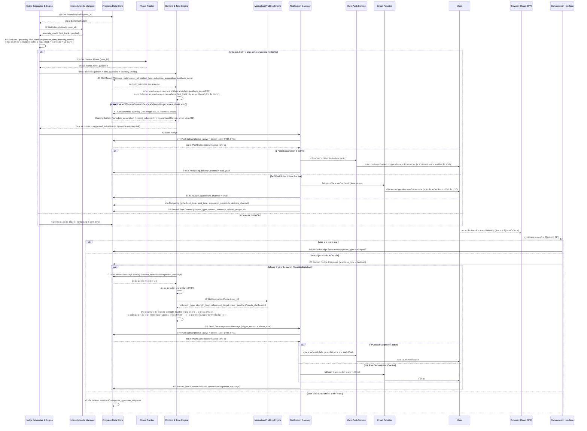
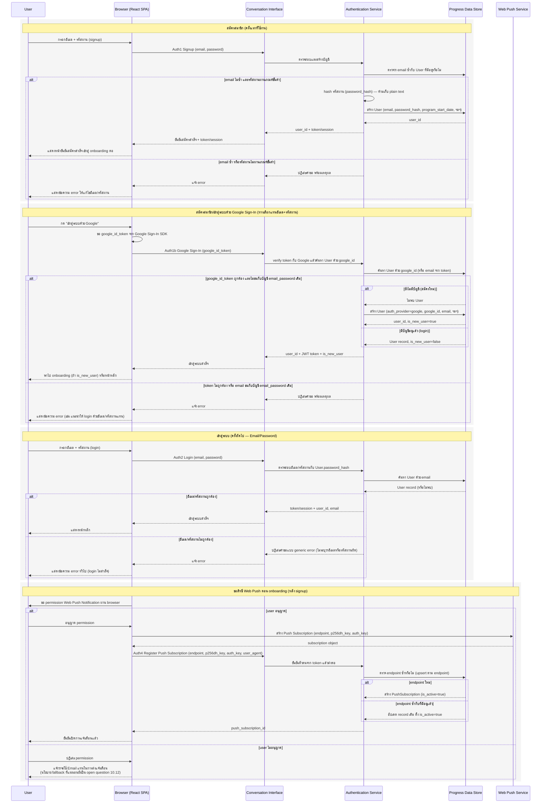
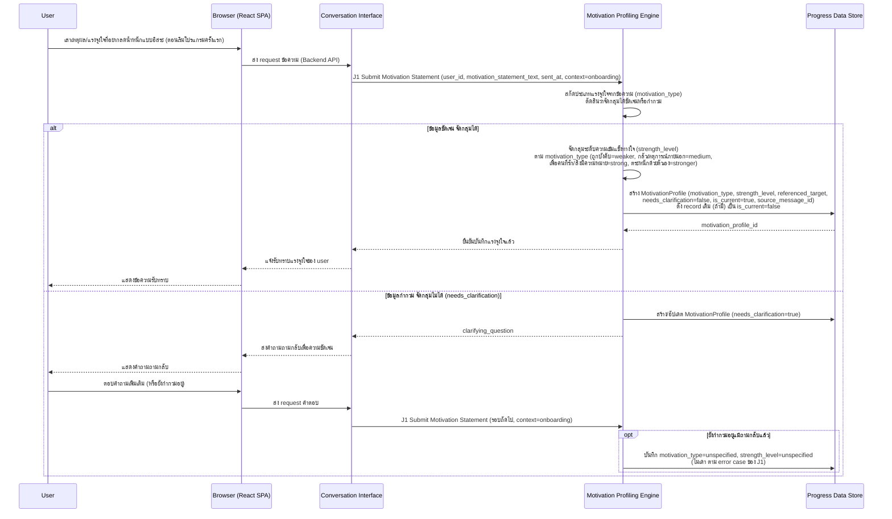
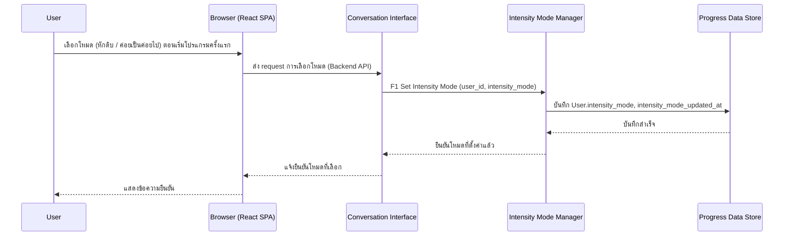
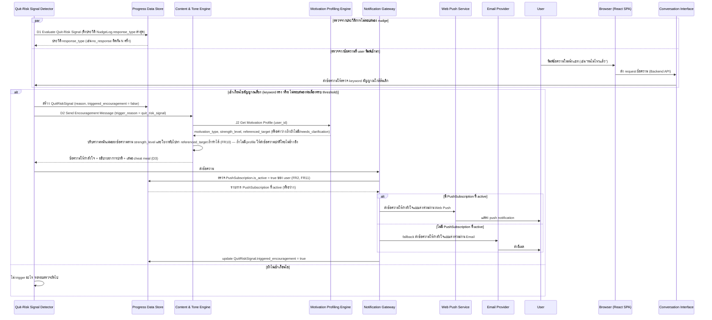
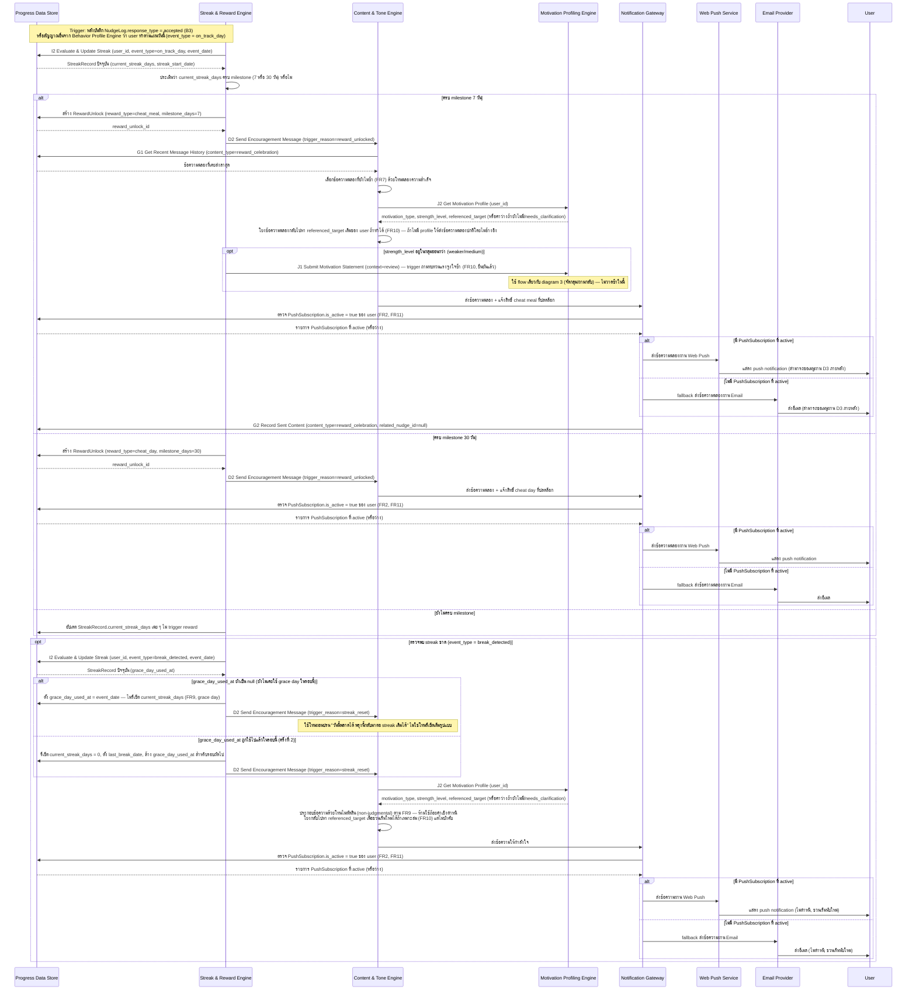
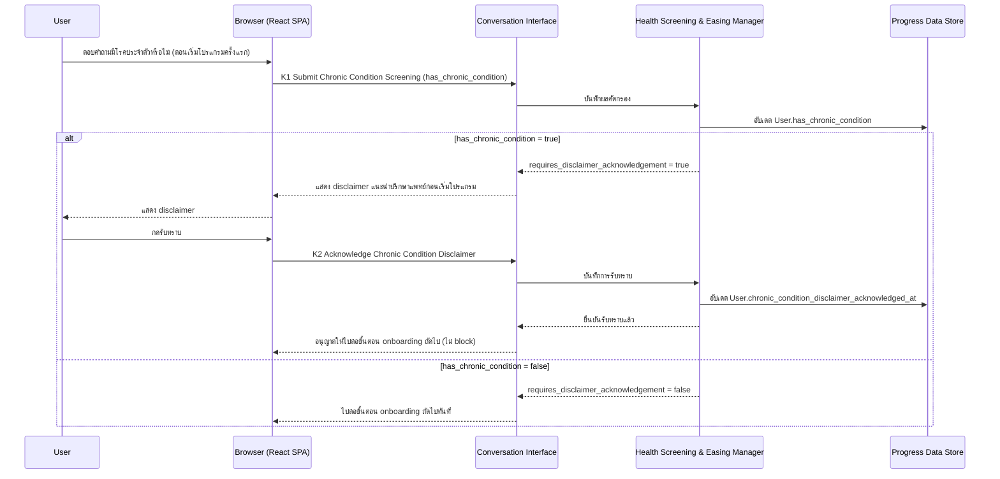
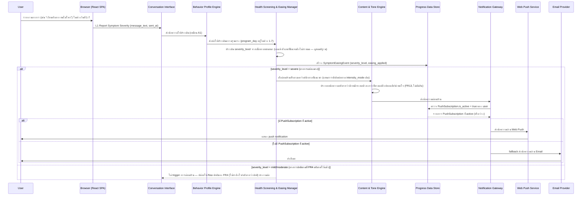

# Detailed Design — Proactive Nudge

- **สถานะ:** Concrete — ผูกกับ technology stack ที่ตัดสินใจแล้วตาม Confirmed Decision รอบ pivot (2026-08-28 รอบ 3): **Backend: Node.js (Express) · Frontend: React (Vite/SPA) · Database: PostgreSQL · Notification: Web Push API (หลัก) + Email (สำรอง) · Authentication: Email/Password + session/token** ชื่อ component ตรงกับ [[20260827-01-high-level-architecture|High Level Architecture]] และ operation ตรงกับ [[20260827-03-api-spec|API Spec]] / entity ตรงกับ [[20260827-02-database-schema|Database Schema]]
- **วันที่จัดทำ:** 2026-08-27
- **ปรับปรุงล่าสุด:** 2026-08-28 — เพิ่ม interaction กับ Intensity Mode Manager และ Message Variety/Downside Warning (G1/G2/H1) ใน diagram ส่ง nudge, เพิ่ม diagram onboarding เลือกโหมด และ diagram Reward System ตาม FR6-FR9 ที่อัปเดตในเอกสารต้นทางทั้งชุด
- **ปรับปรุงล่าสุด:** 2026-08-28 (รอบ 2) — เพิ่ม interaction กับ Motivation Profiling Engine (J1/J2) ทุกจุดที่เรียก D2 Send Encouragement Message, เพิ่ม diagram onboarding เก็บ motivation profile (journey step AM) ก่อน diagram เลือกโหมดความเข้มข้น, อัปเดต error handling และ mapping table ตาม FR10 ที่อัปเดตในเอกสารต้นทางทั้งชุด
- **ปรับปรุงล่าสุด:** 2026-08-28 (รอบ 3 — Pivot ช่องทาง) — เปลี่ยน participant "LINE Platform" ในทุก sequence diagram เป็น "Browser (React SPA)" สำหรับการโต้ตอบของ user และเปลี่ยนจุดส่งข้อความออกเป็น "Web Push Service"/"Email Provider" ผ่าน Notification Gateway (มี logic เลือกช่องทางตาม `PushSubscription.is_active`), เพิ่ม diagram ใหม่สำหรับ Signup/Login และขอสิทธิ์ Web Push (FR11) ก่อน diagram onboarding เดิม, อัปเดต error handling และ mapping table ตามที่ปรับในเอกสารต้นทางทั้งชุด — แนวคิดฟีเจอร์/data flow เดิมยังคงไว้เหมือนเดิม เปลี่ยนแค่ช่องทาง ดู [[../../05-log/20260828-03-log|log 2026-08-28 รอบ 3]]
- **ปรับปรุงล่าสุด:** 2026-08-29 (รอบ 4 — ปิด Open Questions) — เพิ่ม diagram 7 (Chronic Condition Screening, FR12) และ diagram 8 (Adaptive Symptom Easing, FR13), อัปเดต diagram 6 (Reward System) ให้มี branch grace day ก่อนรีเซ็ต streak จริงและ trigger การถามทบทวนแรงจูงใจซ้ำหลังปลดล็อกรางวัลสำหรับ user กลุ่มอ่อนกว่า, อัปเดต diagram 2 ให้รองรับ Google Sign-In, อัปเดต error handling table และ mapping table ตามการตัดสินใจที่ยืนยันแล้ว — ดู [[../../05-log/20260829-log|log 2026-08-29]]
- **Flow ที่ครอบคลุม:** [[../01-prototypes/20260827-01-user-journey-proactive-nudge|User Journey — Proactive Nudge ก่อนเวลาเสี่ยง]] (journey step S, AM, A0-N ทั้งหมด)

## 1. Sequence Diagram — ส่ง Nudge และรับผลตอบสนอง (Happy Path + ปฏิเสธ + เงียบ)

## 2. Sequence Diagram — Signup/Login และขอสิทธิ์ Web Push (journey step S, FR11)

> เกิดก่อน diagram 3 (เก็บ motivation profile, journey step AM) เสมอ ตาม dashed line ของ journey step S → AM ในเอกสารต้นทาง ครอบคลุม happy path ของ signup/login และ edge case ที่มีหลักฐานรองรับใน Auth1/Auth2/Auth4 ของ API Spec (อีเมลซ้ำ, รหัสผ่าน/อีเมลไม่ถูกต้อง, ไม่อนุญาต Web Push)

## 3. Sequence Diagram — Onboarding: เก็บ Motivation Profile (journey step AM)

> เกิดหลัง diagram 2 (signup/login + ขอสิทธิ์ Web Push) และก่อน diagram 4 (เลือกโหมดความเข้มข้น) เสมอ ตาม dashed line ของ journey step S → AM → A0 ในเอกสารต้นทาง ครอบคลุม happy path (จัดกลุ่มได้ชัดเจน) และ edge case ที่มีหลักฐานรองรับใน J1 ของ API Spec — กรณีข้อมูลกำกวมต้องถามกลับ

## 4. Sequence Diagram — Onboarding: เลือกโหมดความเข้มข้น (journey step A0)

> Flow สั้นและไม่มี branch ซับซ้อน จึงแยกเป็น diagram เดียวแบบกระชับ ครอบคลุมเฉพาะ happy path เพราะเอกสารต้นทางไม่มีหลักฐาน edge case ของขั้นตอนนี้ (ดูหัวข้อสมมติฐาน) — เกิดหลัง diagram 3 (เก็บ motivation profile) ตามลำดับ dashed line ของ journey (AM → A0)

## 5. Sequence Diagram — Detect สัญญาณใกล้ล้มเลิก (Quit-Risk)

## 6. Sequence Diagram — Reward System: ตรวจ Streak → ปลดล็อก → แจ้ง User (journey step M, N)

## 7. Sequence Diagram — Onboarding: Chronic Condition Screening (journey step CC, FR12)

## 8. Sequence Diagram — Adaptive Symptom Easing (journey step ใหม่ระหว่าง F/H, FR13)

## 9. Error / Exception Handling ที่เกี่ยวข้องกับ Flow นี้

| กรณี | การจัดการ | หมายเหตุ |
|---|---|---|
| ส่งข้อความผ่าน Web Push และ Email ไม่สำเร็จทั้งสองช่องทาง (เช่น push service ปฏิเสธ และ email server ล้มเหลว) | `Notification Gateway` บันทึก `NudgeLog.sent_time = null` พร้อมเหตุผลความล้มเหลว ไม่ retry อัตโนมัติในระดับ conceptual นี้ | ตรงกับ error case ของ B2/D2 ใน [[20260827-03-api-spec|API Spec]] — นโยบาย retry จริงยังเป็น open question ดูสมมติฐาน |
| Web Push ส่งไม่สำเร็จเพราะ endpoint หมดอายุถาวร (HTTP 410 Gone จาก push service) | `Notification Gateway` ตั้ง `PushSubscription.is_active = false` แล้ว fallback ไปส่ง Email ทันทีในคำขอเดียวกัน | ตรงกับ error case ของ B2 ใน [[20260827-03-api-spec|API Spec]] |
| ไม่มี `PushSubscription` ที่ `is_active = true` ของ user เลย (ไม่เคยอนุญาต/ถอน permission ทั้งหมด) | `Notification Gateway` ข้ามการตรวจ Web Push แล้วส่งผ่าน Email ไปยัง `User.email` โดยตรง | ตรงกับ logic fallback ของ B2/D2 ใน [[20260827-03-api-spec|API Spec]] ตาม FR2/FR11 |
| ข้อความตอบกลับของ user กำกวม (ไม่ชัดว่าทำตามหรือปฏิเสธ) | `Conversation Interface` ส่งต่อให้ `Behavior Profile Engine` ถามกลับ (clarifying question) ตาม FR1 แทนการเดา `response_type` | สอดคล้องกับ FR1 (F3) ในเอกสาร spec |
| เกินเพดาน nudge/วันพอดีตอนที่ risk window ใกล้ถึง | `Nudge Scheduler` ข้าม nudge รอบนั้น บันทึกเหตุผลไว้ใน log แต่ไม่ล้มทั้ง process | ตรงกับ journey step C ("เลื่อน/งด nudge รอบนี้") |
| ไม่พบ `WarningContent` ที่ตรง phase/intensity_mode ปัจจุบัน (H1) | `Content & Tone Engine` คืนรายการว่างและส่ง nudge ต่อโดยไม่มีคำเตือนแนบ ไม่ block การส่งข้อความหลัก | ตรงกับ error case ของ H1 ใน [[20260827-03-api-spec|API Spec]] — คำเตือนเป็นส่วนเสริม ไม่ใช่เนื้อหาบังคับ |
| ไม่มีเนื้อหา (substitute/encouragement/celebration) ที่ยังไม่ซ้ำเหลืออยู่ใน pool ที่ตรวจจาก G1 | `Content & Tone Engine` เลือกเนื้อหาที่นานที่สุดที่เคยส่ง (least-recently-used) แทนการหยุดส่ง | ยังไม่ยืนยัน logic นี้เป็นทางการ เป็นการตีความจาก capability "หมุนเวียนไม่ให้ซ้ำ" ของ FR7 — ดูสมมติฐาน |
| `RewardUnlock` ที่ถูกเรียกผ่าน D3/I4 ถูกใช้สิทธิ์ไปแล้ว (`used_at` ไม่เป็น null) | `Notification Gateway`/`Streak & Reward Engine` ปฏิเสธคำขอใช้สิทธิ์ซ้ำ พร้อมแจ้งเหตุผล | ตรงกับ error case ของ D3 และ I4 ใน [[20260827-03-api-spec|API Spec]] |
| `event_type = break_detected` ใน I2 (streak ขาด) | `Streak & Reward Engine`/`Content & Tone Engine` ต้องใช้โทนไม่ตัดสิน (non-judgmental) เสมอ ห้ามส่งข้อความเชิงตำหนิ | ตรงกับ error case ของ I2 ใน [[20260827-03-api-spec|API Spec]] และ FR9 |
| การเปลี่ยนโหมดความเข้มข้นภายหลัง (F21) ไม่ได้เรียก F3 (Preview) มาก่อน | `Intensity Mode Manager` ปฏิเสธคำขอเปลี่ยนโหมด | ยืนยันแล้วว่าเปลี่ยนได้ไม่จำกัดจำนวนครั้ง (เดิม open question 10.6) แต่ diagram 4 ยังไม่วาด flow เปลี่ยนโหมดภายหลังโดยละเอียด มีเฉพาะ onboarding ครั้งแรก — ควรเพิ่มในรอบถัดไป |
| ข้อความแรงจูงใจของ user กำกวม/จัดกลุ่มไม่ได้ตอน onboarding (J1) | `Motivation Profiling Engine` ถามกลับ (`clarifying_question`) ผ่าน `Conversation Interface` แทนการเดา `motivation_type`/`strength_level` ถ้ายังกำกวมอยู่หลังถามกลับ ให้บันทึกเป็น `motivation_type = unspecified`, `strength_level = unspecified` แทนการเดาต่อ | ตรงกับ error case ของ J1 ใน [[20260827-03-api-spec|API Spec]] และหลักการเดียวกับ FR1 (ดู diagram 3) |
| ไม่พบ `MotivationProfile` ที่ `is_current = true` ตอนที่ D2 เรียก J2 (เช่น user ยังไม่เคยตอบ หรือค้างอยู่ที่ `needs_clarification = true`) | `Content & Tone Engine` ส่งข้อความให้กำลังใจ/ฉลองตามปกติโดยไม่อ้างอิงแรงจูงใจ ไม่ block การส่งข้อความหลัก | ตรงกับ error case ของ J2 ใน [[20260827-03-api-spec|API Spec]] — ใช้ในทุกจุดที่ D2 เรียก J2 (diagram 1, 5, 6) |
| สมัครสมาชิก (signup) ด้วยอีเมลที่มีอยู่แล้วในระบบ | `Authentication Service` ปฏิเสธคำขอ พร้อมแจ้งเหตุผลว่าอีเมลซ้ำ ไม่สร้าง `User` ใหม่ | ตรงกับ error case ของ Auth1 ใน [[20260827-03-api-spec|API Spec]] |
| Login ด้วยอีเมล/รหัสผ่านไม่ถูกต้อง | `Authentication Service` ปฏิเสธคำขอแบบ generic error (ไม่ระบุว่าอีเมลหรือรหัสผ่านผิด) เพื่อลดความเสี่ยง user enumeration | ตรงกับ error case ของ Auth2 ใน [[20260827-03-api-spec|API Spec]] |
| ไม่มี token / token หมดอายุ / token ไม่ถูกต้องตอนเรียก operation ที่ต้อง authentication | ระบบคืนสถานะ unauthorized สำหรับทุก operation ที่ต้อง authentication (ยกเว้น signup/login/Google Sign-In) | ตรงกับหมายเหตุ Authentication ร่วมของทุก operation ใน [[20260827-03-api-spec|API Spec]] |
| Google Sign-In ด้วยอีเมลที่มีบัญชี `auth_provider = email_password` อยู่แล้ว | `Authentication Service` ปฏิเสธคำขอ พร้อมแนะนำให้ login ด้วยอีเมล/รหัสผ่านแทน ไม่ auto-merge บัญชี | ตรงกับ error case ของ Auth1b ใน [[20260827-03-api-spec|API Spec]] |
| streak ขาดครั้งแรกในรอบ (grace day ยังไม่เคยใช้) | `Streak & Reward Engine` ตั้ง `grace_day_used_at` ไม่รีเซ็ต `current_streak_days` และส่งข้อความโทนผ่อนปรน ไม่ใช่โทนรีเซ็ตเต็มรูปแบบ | ตรงกับ error case ของ I2 ใน [[20260827-03-api-spec|API Spec]] และ FR9 (grace day, ยืนยันแล้ว) |
| streak ขาดครั้งที่ 2 ในรอบเดียวกัน (grace day ใช้ไปแล้ว) | `Streak & Reward Engine` รีเซ็ต `current_streak_days = 0` ด้วยโทนไม่ตัดสินตามปกติของ FR9 | ตรงกับ error case ของ I2 ใน [[20260827-03-api-spec|API Spec]] |
| user รายงานอาการในช่วงวันที่ 1-7 ที่ `severity_level = severe` (FR13) | `Health Screening & Easing Manager` สั่งผ่อนปรนปริมาณคาร์บ/น้ำตาลผ่าน `Content & Tone Engine` โดยไม่เปลี่ยน phase timeline | ตรงกับ diagram 8 และ error case ของ L1 ใน [[20260827-03-api-spec|API Spec]] |
| user เปลี่ยนโหมดความเข้มข้นภายหลังโดยไม่เรียก F3 (Preview) มาก่อน (`change_acknowledged != true`) | `Intensity Mode Manager` ปฏิเสธคำขอ F1 พร้อมแนะนำให้เรียก F3 ก่อน | ตรงกับ error case ของ F1 ใน [[20260827-03-api-spec|API Spec]] — ยืนยันแล้วว่าไม่จำกัดจำนวนครั้งที่เปลี่ยน (เดิม open question 10.6) แต่ต้องอธิบายผลลัพธ์ก่อนเสมอ (F39) |

## 10. ตาราง Mapping Step → Requirement / Journey Step

| Step (diagram) | อ้างอิง Requirement | อ้างอิง Journey Step |
|---|---|---|
| Auth1 Signup, Auth2 Login (diagram 2) | FR11 (F35, F36) | S |
| Auth4 Register Push Subscription (diagram 2) | FR11 (F37, F38), FR2 | S |
| A2 Get Behavior Profile, F2 Get Intensity Mode, B1 Evaluate Upcoming Risk Windows (diagram 1) | FR1 (F4), FR2 (F5, F7), FR6 (F19, F20) | A, B, C |
| C1 Get Current Phase → ประกอบข้อความด้วย Content & Tone Engine (diagram 1) | FR3 (F10) | D |
| G1 Get Recent Message History, H1 Get Downside Warning Content (diagram 1) | FR7 (F22, F23), FR8 (F24, F25) | E |
| B2 Send Nudge (ตรวจ PushSubscription → Web Push/Email), G2 Record Sent Content (diagram 1) | FR2 (F5, F6), FR6 (F19, F20), FR7 (F22, F23), FR8 (F24, F25), FR11 | E |
| B3 Record Nudge Response (accepted/declined/no_response) (diagram 1) | FR2, FR5 (F16) | F, G, H, I |
| D2 Send Encouragement Message + J2 Get Motivation Profile (phase หนัก, หลังปฏิเสธ) (diagram 1) | FR3 (F10), FR4 (F12), FR7 (F22, F23), FR10 (F32, F33), FR11 | H |
| J1 Submit Motivation Statement → จัดกลุ่ม/ถามกลับ (diagram 3 — onboarding) | FR10 (F30, F31, F34) | AM |
| F1 Set Intensity Mode (diagram 4 — onboarding) | FR6 (F18) | A0 |
| D1 Evaluate Quit-Risk Signal (diagram 5) | FR4 (F13) | K |
| D2 Send Encouragement Message + J2 Get Motivation Profile (trigger = quit_risk_signal) (diagram 5) | FR4 (F12), FR4 (F13), FR10 (F32, F33), FR11 | L |
| I2 Evaluate & Update Streak → ครบ milestone → สร้าง RewardUnlock (diagram 6) | FR9 (F26, F27, F28) | M, N |
| D2 Send Encouragement Message + J2 Get Motivation Profile (trigger = reward_unlocked) + G1/G2 (diagram 6) | FR9 (F27, F28), FR7 (F22, F23), FR10 (F32, F33), FR11 | N |
| I2 Evaluate & Update Streak (event_type = break_detected, grace day) → D2 + J2 (trigger = streak_reset) (diagram 6) | FR9 (F29), FR10 (F32, F33), FR11 | J (นัยจาก "อัปเดต behavior profile/metrics" — streak reset ยังไม่มี step เฉพาะใน journey ต้นทาง ดูสมมติฐาน) |
| K1 Submit Chronic Condition Screening, K2 Acknowledge Disclaimer (diagram 7) | FR12 (F40, F41, F42) | CC |
| L1 Report Symptom Severity, L2 Get Easing Status (diagram 8) | FR13 (F43, F44) | ไม่มี step เฉพาะใน journey ต้นทาง — เกิดคู่ขนานกับ step F/H เมื่อ user รายงานอาการ (ดูสมมติฐาน) |

## 11. สมมติฐาน/คำถามที่ต้องยืนยัน

- **Timeout window ที่ถือว่า "ไม่ตอบสนอง" (no_response)** ใน diagram 1 ยังไม่มีค่าตัวเลขที่ยืนยัน — แม้ default lead time (15-30 นาที) และเพดาน nudge/วันแบบปรับอัตโนมัติตาม phase จะยืนยันแล้ว (เดิม open question 10.1/10.3) ต้องกำหนด timeout window ที่แน่นอนก่อน implement จริง
- **Threshold "ไม่ตอบสนองต่อเนื่อง" ใน diagram 5** (จำนวนครั้งที่ถือว่าต้อง trigger สัญญาณเสี่ยง) ยังไม่มีตัวเลขที่ยืนยัน แม้กลไก detect แบบผสม (keyword/sentiment + engagement pattern) จะยืนยันแล้ว (เดิม open question 10.2)
- diagram 5 วาด 2 แหล่งสัญญาณ (keyword จากข้อความ, ประวัติ no-response) ทำงานแบบขนาน (`par`) ตรงกับกลไกผสมที่ยืนยันแล้ว (เดิม open question 10.2) — ทั้งสองแหล่งต้องทำงานร่วมกันเสมอตามที่ตัดสินใจแล้ว ไม่ใช่เลือกใช้แค่แหล่งเดียว
- Sequence ทั้งหมดไม่ได้ระบุว่า `Nudge Scheduler`, `Quit-Risk Signal Detector`, และ `Streak & Reward Engine` (I2) ทำงานแบบ polling ตามรอบเวลาเท่าไหร่ หรือถูก trigger แบบ synchronous ทันทีหลัง event ในระดับ implementation จริงบน Node.js/Express (เช่น cron job ภายใน backend หรือ event-driven) — เป็นรายละเอียดเชิงเทคนิคที่ยังไม่ตัดสินใจ (สอดคล้องกับสมมติฐานเดียวกันใน High Level Architecture และ API Spec เรื่อง B1/D1/I2)
- ยังไม่มี sequence diagram แยกสำหรับกรณี user ใหม่ที่ยังไม่มี `BehaviorPattern` เพียงพอ (ตรงกับสมมติฐานเดิมใน User Journey ต้นทางว่ายังไม่ครอบคลุม flow นี้) — ควรทำเพิ่มเมื่อมี journey ของ onboarding
- **Logic การนับ/รีเซ็ต streak ที่แท้จริงใน diagram 6** (I2) ยืนยันแล้ว (เดิม open question 10.9): มี grace day 1 วันก่อนตัดจริง — diagram อัปเดตให้มี branch ตรวจ `grace_day_used_at` แล้ว รายละเอียดเชิง edge case เพิ่มเติม (เช่น grace day ที่ใช้ไปคาบเกี่ยวกับการเริ่ม streak รอบใหม่พอดี) ยังไม่ครอบคลุมในเอกสารนี้
- **เกณฑ์ตัดสินว่า "ทำตามแผนวันนี้" (event_type = on_track_day) ที่ป้อนเข้า I2** ยังไม่ยืนยันว่ามาจาก `NudgeLog.response_type = accepted` เพียงอย่างเดียว หรือรวมสัญญาณอื่นจาก `Behavior Profile Engine`/`Conversation Message` ด้วย (เช่น user ไม่มี nudge วันนั้นเลยแต่ก็ไม่ได้กินของเสี่ยง) — diagram 6 สมมติแหล่งสัญญาณหลักจาก B3 ไว้ก่อนตามที่ journey เชื่อมจาก step G
- **กลไกหมุนเวียนเนื้อหาจริง (FR7, G1/G2)** ที่ใช้ใน diagram 1/6 (เลือกเนื้อหาที่ยังไม่ซ้ำ) ยืนยันแล้ว (เดิม open question 10.7): ใช้แบบผสม content library เป็นฐาน + AI ปรับถ้อยคำ/มุมมอง — diagram แสดง capability "query ประวัติแล้วเลือกสิ่งที่ไม่ซ้ำ" ตรงกับกลไกนี้แล้ว แต่ logic "least-recently-used" ที่เพิ่มในตาราง error handling ยังเป็นการตีความเพิ่มเติม ไม่ใช่การตัดสินใจที่ยืนยันเป็นทางการ
- **Threshold/เงื่อนไขที่ตัดสินว่าควรแนบ `WarningContent` (H1) ในรอบ nudge ไหนบ้าง** ใน diagram 1 เขียนเป็น "phase ปัจจุบันมี WarningContent ที่ตรงเงื่อนไข (severity สูง/กำลังจะเข้า phase หนัก)" เป็นการตีความ conceptual — ความถี่ที่เหมาะสมในการแนบคำเตือน (ทุกครั้ง/เป็นระยะ) ยังเป็น open question ตามที่ระบุใน API Spec (H1)
- **diagram 4 (onboarding เลือกโหมด)** ครอบคลุมเฉพาะ happy path เพราะ journey ต้นทางวาด step A0 เป็น dashed line แบบสรุปสั้น ไม่มีรายละเอียด edge case (เช่น user เลือกโหมดไม่ถูกต้อง/ไม่ตอบ) — ยังไม่มีหลักฐานรองรับ edge case เหล่านี้ ต้องยืนยันหากต้องการ diagram ที่ละเอียดกว่านี้
- **ความสัมพันธ์ระหว่าง Quit-Risk Signal Detector กับ Streak & Reward Engine** ยังไม่เชื่อมกันใน diagram ใด ๆ ในเอกสารนี้ (ตรงกับสมมติฐานเดียวกันใน High Level Architecture) — เช่น ยังไม่ชัดว่าเมื่อเกิด `QuitRiskSignal` แล้ว streak ควรหยุดนับชั่วคราวหรือไม่
- **การจัดกลุ่มระดับความเข้มแข็งทางใจ (FR10, เดิม open question 10.10)** ยืนยันแล้วว่าใช้ 4 กลุ่มจากประสบการณ์ผู้ก่อตั้งเป็นฐาน (diagram 3) แต่ AI มีความยืดหยุ่นปรับระดับจากบทสนทนาจริงได้ ไม่ยึดติดตายตัว 100% — diagram 3 ยังวาดเป็นการจัดกลุ่มตายตัวแบบง่าย logic การปรับแบบยืดหยุ่นยังไม่ได้ออกแบบละเอียดในเอกสารนี้ และยังไม่ผ่านการ validate จากนักจิตวิทยา/ผู้เชี่ยวชาญด้าน behavior change เป็นทางการ
- **การถาม/ทบทวนแรงจูงใจซ้ำหลัง onboarding (FR10, เดิม open question 10.11)** ยืนยันแล้ว: กลุ่มเข้มแข็งถามครั้งเดียว (diagram 3), กลุ่มอ่อนกว่าถามทบทวนเป็นระยะหลัง reward — diagram 6 อัปเดตให้มี flow เรียก J1 (`context=review`) ซ้ำจาก `Streak & Reward Engine` เข้า `Motivation Profiling Engine` แล้ว (อ้างอิง flow เดียวกับ diagram 3 ไม่วาดซ้ำ)
- **จุดที่ต้องเรียก J2 (Get Motivation Profile)** ในเอกสารนี้ยึดตาม [[20260827-03-api-spec|API Spec]] ที่ระบุชัดว่า D2 (Send Encouragement Message) ต้องเรียก J2 เสมอทุก `trigger_reason` (จึงเพิ่มใน diagram 1, 5, 6) — แต่ journey ต้นทาง step E ยังกล่าวถึงการปรับความหนักเบา/ความถี่ตาม motivation profile ใน **ข้อความ nudge หลัก** (B2) ด้วย ซึ่ง API Spec ยังไม่ได้ปรับ B2 ให้เรียก J2 อย่างเป็นทางการ — diagram 1 (nudge หลัก) จึงยังไม่เพิ่ม J2 ที่ B2 ในรอบนี้ ต้องยืนยันกับผู้จัดทำ API Spec ว่าจำเป็นต้องเพิ่มหรือไม่
- **เกณฑ์ `severity_level = severe` ใน diagram 8 (FR13)** ยังไม่มีตัวเลข/คำที่ชัดเจนว่าอาการระดับไหนถือว่า "แย่ลงมาก" จนต้อง trigger การผ่อนปรน แตกต่างจากอาการปกติที่ FR4 อธิบายไว้แล้ว (มือสั่น หงุดหงิด) — เป็นรายละเอียดที่ AI classification logic ของ `Health Screening & Easing Manager` ต้องกำหนดเกณฑ์เพิ่มเติมตอน implement เช่นเดียวกับสมมติฐานเดียวกันใน Database Schema
- **UX ของ diagram 7 (Chronic Condition Screening)** สมมติว่าเป็นคำถามปิด (yes/no) ผ่านหน้าจอ ไม่ใช่บทสนทนาอิสระแบบ FR1/FR10 — ยังไม่ยืนยันว่า MVP จะใช้ conversational UX หรือฟอร์มปิดจริง เป็นการตัดสินใจของทีมออกแบบ UI ที่ยังไม่ได้ทำ mockup รองรับ
- **diagram 8 วางตำแหน่งเกิดคู่ขนานกับ journey step F/H** (ตอน user รายงานอาการผ่านบทสนทนาทั่วไป) เพราะ journey ต้นทางไม่มี step เฉพาะสำหรับ FR13 — ควรปรับปรุง [[../01-prototypes/20260827-01-user-journey-proactive-nudge|User Journey ต้นทาง]] ให้มี step ที่ชัดเจนกว่านี้ในรอบถัดไป
- **นโยบาย fallback เมื่อ user ไม่อนุญาต Web Push (FR2, FR11, เดิม open question 10.12)** ยืนยันแล้ว: ใช้ Email ทันทีแบบไม่ถามซ้ำ ไม่เพิ่มช่องทางอื่น — logic ตรวจ `PushSubscription.is_active` แล้ว fallback ไป Email ที่ปรากฏในทุก diagram ที่มีการส่งข้อความออก (diagram 1, 5, 6, 8) ตรงกับนโยบายที่ยืนยันแล้วพอดี
- **กลไก authentication/session ที่แน่นอน (FR11, เดิม open question 10.13)** ยืนยันแล้ว: **JWT Token** เป็นกลไกหลัก รองรับ Google Sign-In และ Email/Password — diagram 2 อัปเดตให้แสดง flow ทั้งสองวิธีแล้ว (Google Sign-In ผ่าน Auth1b) รายละเอียด token expiry/refresh flow ยังต้องกำหนดตอน implement
